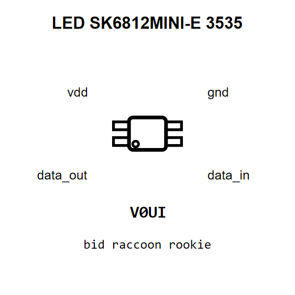

<!-- Generated item page. Full data lives in the source repository. -->
[Catalogue](../../../../../../../README.md) / [Electronic](../../../../../../README.md) / [LED](../../../../../README.md) / [3535](../../../../README.md) / [Rgb](../../../README.md) / [Sk6812](../../README.md) / [Opsco Optoelectronics](../README.md) / Sk6812mini E

# ⚡ LED SK6812MINI-E 3535

> LED SK6812MINI-E 3535 is an OOMP electronic led definition. It uses the 3535 package or form factor. Its nominal drawing size is 3.5 × 3.5 mm. The definition includes 4 documented pins.

[Full details →](https://github.com/oomlout/oomp_electronic_version_5/tree/main/parts/electronic_led_3535_rgb_sk6812_opsco_optoelectronics_sk6812mini_e)

## At a glance

| Detail | Value |
| --- | --- |
| Type | Led |
| Package / style | 3535 |
| Nominal size | 3.5 × 3.5 mm |
| Documented pins | 4 |
| OOMP ID | `electronic_led_3535_rgb_sk6812_opsco_optoelectronics_sk6812mini_e` |

## Catalogue location

`Electronic › LED › 3535 › Rgb › Sk6812 › Opsco Optoelectronics › Sk6812mini E`

## About this page

This is the compact catalogue view. A detailed source README is available. Schematics, fabrication data, working metadata, alternate diagrams, availability data, and project analysis stay with the [full original record](https://github.com/oomlout/oomp_electronic_version_5/tree/main/parts/electronic_led_3535_rgb_sk6812_opsco_optoelectronics_sk6812mini_e).

---

[↑ Parent category](../README.md) · [Catalogue home](../../../../../../../README.md)
