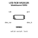

<!-- Generated item page. Full data lives in the source repository. -->
[Catalogue](../../../../../../../README.md) / [Electronic](../../../../../../README.md) / [LED](../../../../../README.md) / [5050](../../../../README.md) / [Rgb](../../../README.md) / [Ws2812b](../../README.md) / [Worldsemi](../README.md) / Ws2812b B W

# ⚡ LED RGB WS2812B Worldsemi 5050

> LED RGB WS2812B Worldsemi 5050 is an OOMP electronic led definition. It uses the 5050 package or form factor. Its nominal drawing size is 5.0 × 5.0 mm. The definition includes 4 documented pins.

**[Full details →](https://github.com/oomlout/oomp_electronic_version_5/tree/main/parts/electronic_led_5050_rgb_ws2812b_worldsemi_ws2812b_b_w)**

## At a glance

| Detail | Value |
| --- | --- |
| Type | Led |
| Package / style | 5050 |
| Nominal size | 5.0 × 5.0 mm |
| Documented pins | 4 |
| OOMP ID | `electronic_led_5050_rgb_ws2812b_worldsemi_ws2812b_b_w` |

## Catalogue location

`Electronic › LED › 5050 › Rgb › Ws2812b › Worldsemi › Ws2812b B W`

## About this page

This is the compact catalogue view. A detailed source README is available. Schematics, fabrication data, working metadata, alternate diagrams, availability data, and project analysis stay with the [full original record](https://github.com/oomlout/oomp_electronic_version_5/tree/main/parts/electronic_led_5050_rgb_ws2812b_worldsemi_ws2812b_b_w).

---

[↑ Parent category](../README.md) · [Catalogue home](../../../../../../../README.md)
