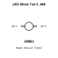

<!-- Generated item page. Full data lives in the source repository. -->
[Catalogue](../../../../../README.md) / [Electronic](../../../../README.md) / [LED](../../../README.md) / [5 Mm](../../README.md) / [White](../README.md) / Tint

# ⚡ LED White Tint 5_MM

> LED White Tint 5_MM is an OOMP electronic led definition. It uses the 5 mm package or form factor. Its nominal drawing size is 5.0 × 5.0 mm.

**[Full details →](https://github.com/oomlout/oomp_electronic_version_5/tree/main/parts/electronic_led_5_mm_white_tint)**

## At a glance

| Detail | Value |
| --- | --- |
| Type | Led |
| Package / style | 5 mm |
| Nominal size | 5.0 × 5.0 mm |
| OOMP ID | `electronic_led_5_mm_white_tint` |

## Catalogue location

`Electronic › LED › 5 Mm › White › Tint`

## About this page

This is the compact catalogue view. A detailed source README is available. Schematics, fabrication data, working metadata, alternate diagrams, availability data, and project analysis stay with the [full original record](https://github.com/oomlout/oomp_electronic_version_5/tree/main/parts/electronic_led_5_mm_white_tint).

---

[↑ Parent category](../README.md) · [Catalogue home](../../../../../README.md)
