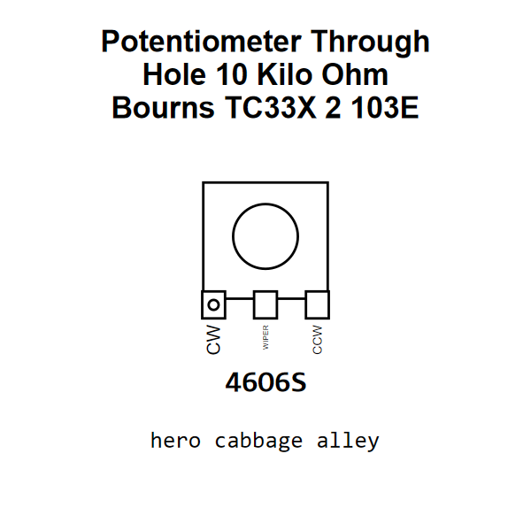

<!-- Generated item page. Full data lives in the source repository. -->
[Catalogue](../../../../../../../README.md) / [Electronic](../../../../../../README.md) / [Potentiometer](../../../../../README.md) / [Trimmer](../../../../README.md) / [Through Hole](../../../README.md) / [10 Kilo Ohm](../../README.md) / [Bourns](../README.md) / Tc33x 2 103e

# ⚡ Potentiometer Through Hole 10 Kilo Ohm Bourns TC33X 2 103E TRIMMER

> Potentiometer Through Hole 10 Kilo Ohm Bourns TC33X 2 103E TRIMMER is an OOMP electronic potentiometer definition. It uses the trimmer package or form factor. Its nominal drawing size is 3.8 × 3.6 mm. The definition includes 3 documented pins.

[Full details →](https://github.com/oomlout/oomp_electronic_version_5/tree/main/parts/electronic_potentiometer_trimmer_through_hole_10_kilo_ohm_bourns_tc33x_2_103e)

## At a glance

| Detail | Value |
| --- | --- |
| Type | Potentiometer |
| Package / style | trimmer |
| Nominal size | 3.8 × 3.6 mm |
| Documented pins | 3 |
| OOMP ID | `electronic_potentiometer_trimmer_through_hole_10_kilo_ohm_bourns_tc33x_2_103e` |

## Catalogue location

`Electronic › Potentiometer › Trimmer › Through Hole › 10 Kilo Ohm › Bourns › Tc33x 2 103e`

## About this page

This is the compact catalogue view. A detailed source README is available. Schematics, fabrication data, working metadata, alternate diagrams, availability data, and project analysis stay with the [full original record](https://github.com/oomlout/oomp_electronic_version_5/tree/main/parts/electronic_potentiometer_trimmer_through_hole_10_kilo_ohm_bourns_tc33x_2_103e).

---

[↑ Parent category](../README.md) · [Catalogue home](../../../../../../../README.md)
