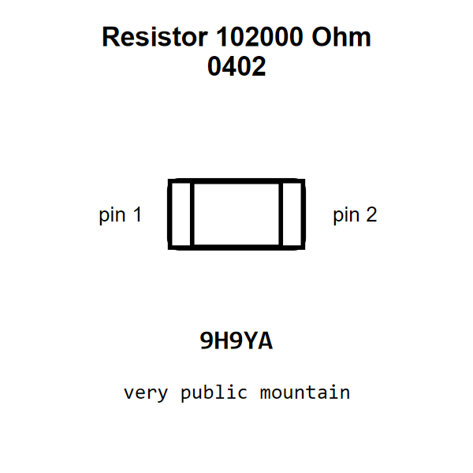

<!-- Generated item page. Full data lives in the source repository. -->
[Catalogue](../../../../README.md) / [Electronic](../../../README.md) / [Resistor](../../README.md) / [0402](../README.md) / 102000 Ohm

# ⚡ Resistor 102000 Ohm 0402

> Resistor 102000 Ohm 0402 is an OOMP electronic resistor definition. It uses the 0402 package or form factor. Its nominal drawing size is 1.0 × 0.5 mm.

[Full details →](https://github.com/oomlout/oomp_electronic_version_5/tree/main/parts/electronic_resistor_0402_102000_ohm)

## At a glance

| Detail | Value |
| --- | --- |
| Type | Resistor |
| Package / style | 0402 |
| Nominal size | 1.0 × 0.5 mm |
| OOMP ID | `electronic_resistor_0402_102000_ohm` |

## Catalogue location

`Electronic › Resistor › 0402 › 102000 Ohm`

## About this page

This is the compact catalogue view. A detailed source README is available. Schematics, fabrication data, working metadata, alternate diagrams, availability data, and project analysis stay with the [full original record](https://github.com/oomlout/oomp_electronic_version_5/tree/main/parts/electronic_resistor_0402_102000_ohm).

---

[↑ Parent category](../README.md) · [Catalogue home](../../../../README.md)
