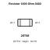

<!-- Generated item page. Full data lives in the source repository. -->
[Catalogue](../../../../README.md) / [Electronic](../../../README.md) / [Resistor](../../README.md) / [0402](../README.md) / 1600 Ohm

# ⚡ Resistor 1600 Ohm 0402

> A concise OOMP catalogue definition organised under Electronic › Resistor › 0402 › 1600 Ohm.

**[Full details →](https://github.com/oomlout/oomp_electronic_version_5/tree/main/parts/electronic_resistor_0402_1600_ohm)**

## At a glance

| Detail | Value |
| --- | --- |
| Type | Resistor |
| Category | Resistor |
| OOMP ID | `electronic_resistor_0402_1600_ohm` |

## Catalogue location

`Electronic › Resistor › 0402 › 1600 Ohm`

## About this page

This is the compact catalogue view. This index entry was built directly from its working metadata. Schematics, fabrication data, working metadata, alternate diagrams, availability data, and project analysis stay with the [full original record](https://github.com/oomlout/oomp_electronic_version_5/tree/main/parts/electronic_resistor_0402_1600_ohm).

---

[↑ Parent category](../README.md) · [Catalogue home](../../../../README.md)
