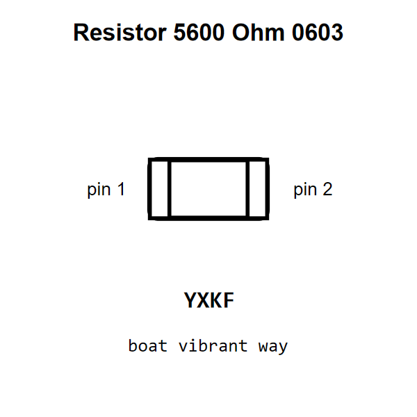

<!-- Generated item page. Full data lives in the source repository. -->
[Catalogue](../../../../README.md) / [Electronic](../../../README.md) / [Resistor](../../README.md) / [0603](../README.md) / 5600 Ohm

# ⚡ Resistor 5600 Ohm 0603

> Resistor 5600 Ohm 0603 is an OOMP electronic resistor definition. It uses the 0603 package or form factor. Its nominal drawing size is 1.6 × 0.8 mm.

[Full details →](https://github.com/oomlout/oomp_electronic_version_5/tree/main/parts/electronic_resistor_0603_5600_ohm)

## At a glance

| Detail | Value |
| --- | --- |
| Type | Resistor |
| Package / style | 0603 |
| Nominal size | 1.6 × 0.8 mm |
| OOMP ID | `electronic_resistor_0603_5600_ohm` |

## Catalogue location

`Electronic › Resistor › 0603 › 5600 Ohm`

## About this page

This is the compact catalogue view. A detailed source README is available. Schematics, fabrication data, working metadata, alternate diagrams, availability data, and project analysis stay with the [full original record](https://github.com/oomlout/oomp_electronic_version_5/tree/main/parts/electronic_resistor_0603_5600_ohm).

---

[↑ Parent category](../README.md) · [Catalogue home](../../../../README.md)
