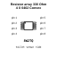

<!-- Generated item page. Full data lives in the source repository. -->
[Catalogue](../../../../../README.md) / [Electronic](../../../../README.md) / [Resistor Array](../../../README.md) / [4 X 0402 Convex](../../README.md) / [330 Ohm](../README.md) / 8 Pin

# ⚡ Resistor array 330 Ohm 4 X 0402 Convex

> Resistor array 330 Ohm 4 X 0402 Convex is an OOMP electronic resistor array definition. It uses the 4 x 0402 convex package or form factor. Its nominal drawing size is 2.0 × 1.0 mm.

**[Full details →](https://github.com/oomlout/oomp_electronic_version_5/tree/main/parts/electronic_resistor_array_4_x_0402_convex_330_ohm_8_pin)**

## At a glance

| Detail | Value |
| --- | --- |
| Type | Resistor Array |
| Package / style | 4 x 0402 convex |
| Nominal size | 2.0 × 1.0 mm |
| OOMP ID | `electronic_resistor_array_4_x_0402_convex_330_ohm_8_pin` |

## Catalogue location

`Electronic › Resistor Array › 4 X 0402 Convex › 330 Ohm › 8 Pin`

## About this page

This is the compact catalogue view. A detailed source README is available. Schematics, fabrication data, working metadata, alternate diagrams, availability data, and project analysis stay with the [full original record](https://github.com/oomlout/oomp_electronic_version_5/tree/main/parts/electronic_resistor_array_4_x_0402_convex_330_ohm_8_pin).

---

[↑ Parent category](../README.md) · [Catalogue home](../../../../../README.md)
