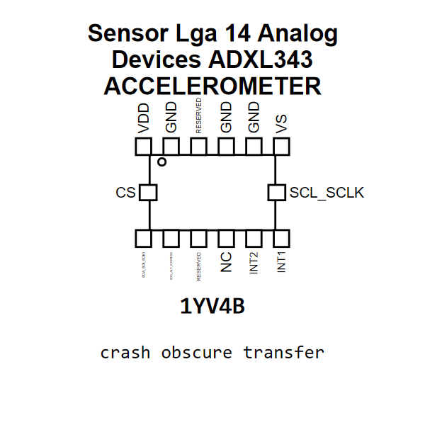

<!-- Generated item page. Full data lives in the source repository. -->
[Catalogue](../../../../../../README.md) / [Electronic](../../../../../README.md) / [Sensor](../../../../README.md) / [Accelerometer](../../../README.md) / [Lga 14](../../README.md) / [Analog Devices](../README.md) / Adxl343

# ⚡ Sensor Lga 14 Analog Devices ADXL343 ACCELEROMETER

> Sensor Lga 14 Analog Devices ADXL343 ACCELEROMETER is an OOMP electronic sensor definition. It uses the accelerometer package or form factor. Its nominal drawing size is 5.0 × 3.0 mm. The definition includes 14 documented pins.

[Full details →](https://github.com/oomlout/oomp_electronic_version_5/tree/main/parts/electronic_sensor_accelerometer_lga_14_analog_devices_adxl343)

## At a glance

| Detail | Value |
| --- | --- |
| Type | Sensor |
| Package / style | accelerometer |
| Nominal size | 5.0 × 3.0 mm |
| Documented pins | 14 |
| OOMP ID | `electronic_sensor_accelerometer_lga_14_analog_devices_adxl343` |

## Catalogue location

`Electronic › Sensor › Accelerometer › Lga 14 › Analog Devices › Adxl343`

## About this page

This is the compact catalogue view. A detailed source README is available. Schematics, fabrication data, working metadata, alternate diagrams, availability data, and project analysis stay with the [full original record](https://github.com/oomlout/oomp_electronic_version_5/tree/main/parts/electronic_sensor_accelerometer_lga_14_analog_devices_adxl343).

---

[↑ Parent category](../README.md) · [Catalogue home](../../../../../../README.md)
