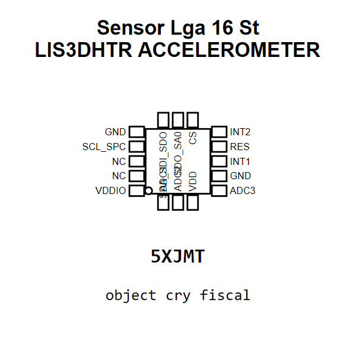

<!-- Generated item page. Full data lives in the source repository. -->
[Catalogue](../../../../../../README.md) / [Electronic](../../../../../README.md) / [Sensor](../../../../README.md) / [Accelerometer](../../../README.md) / [Lga 16](../../README.md) / [St](../README.md) / Lis3dhtr

# ⚡ Sensor Lga 16 St LIS3DHTR ACCELEROMETER

> Sensor Lga 16 St LIS3DHTR ACCELEROMETER is an OOMP electronic sensor definition. It uses the accelerometer package or form factor. Its nominal drawing size is 3.0 × 3.0 mm. The definition includes 16 documented pins.

[Full details →](https://github.com/oomlout/oomp_electronic_version_5/tree/main/parts/electronic_sensor_accelerometer_lga_16_st_lis3dhtr)

## At a glance

| Detail | Value |
| --- | --- |
| Type | Sensor |
| Package / style | accelerometer |
| Nominal size | 3.0 × 3.0 mm |
| Documented pins | 16 |
| OOMP ID | `electronic_sensor_accelerometer_lga_16_st_lis3dhtr` |

## Catalogue location

`Electronic › Sensor › Accelerometer › Lga 16 › St › Lis3dhtr`

## About this page

This is the compact catalogue view. A detailed source README is available. Schematics, fabrication data, working metadata, alternate diagrams, availability data, and project analysis stay with the [full original record](https://github.com/oomlout/oomp_electronic_version_5/tree/main/parts/electronic_sensor_accelerometer_lga_16_st_lis3dhtr).

---

[↑ Parent category](../README.md) · [Catalogue home](../../../../../../README.md)
