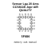

<!-- Generated item page. Full data lives in the source repository. -->
[Catalogue](../../../../../../README.md) / [Electronic](../../../../../README.md) / [Sensor](../../../../README.md) / [Air Quality](../../../README.md) / [Lga 20](../../README.md) / [Ams](../README.md) / Ccs811b Jopr

# ⚡ Sensor Lga 20 Ams CCS811B Jopr AIR QUALITY

> Sensor Lga 20 Ams CCS811B Jopr AIR QUALITY is an OOMP electronic sensor definition. It uses the air quality package or form factor. Its nominal drawing size is 3.0 × 3.0 mm. The definition includes 20 documented pins.

**[Full details →](https://github.com/oomlout/oomp_electronic_version_5/tree/main/parts/electronic_sensor_air_quality_lga_20_ams_ccs811b_jopr)**

## At a glance

| Detail | Value |
| --- | --- |
| Type | Sensor |
| Package / style | air quality |
| Nominal size | 3.0 × 3.0 mm |
| Documented pins | 20 |
| OOMP ID | `electronic_sensor_air_quality_lga_20_ams_ccs811b_jopr` |

## Catalogue location

`Electronic › Sensor › Air Quality › Lga 20 › Ams › Ccs811b Jopr`

## About this page

This is the compact catalogue view. A detailed source README is available. Schematics, fabrication data, working metadata, alternate diagrams, availability data, and project analysis stay with the [full original record](https://github.com/oomlout/oomp_electronic_version_5/tree/main/parts/electronic_sensor_air_quality_lga_20_ams_ccs811b_jopr).

---

[↑ Parent category](../README.md) · [Catalogue home](../../../../../../README.md)
