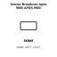

<!-- Generated item page. Full data lives in the source repository. -->
[Catalogue](../../../../../README.md) / [Electronic](../../../../README.md) / [Sensor](../../../README.md) / [Apds 9960](../../README.md) / [Broadcom](../README.md) / Apds 9960

# ⚡ Sensor Broadcom Apds 9960 APDS 9960

> Sensor Broadcom Apds 9960 APDS 9960 is an OOMP electronic sensor definition. It uses the apds 9960 package or form factor. Its nominal drawing size is 10.0 × 5.0 mm.

**[Full details →](https://github.com/oomlout/oomp_electronic_version_5/tree/main/parts/electronic_sensor_apds_9960_broadcom_apds_9960)**

## At a glance

| Detail | Value |
| --- | --- |
| Type | Sensor |
| Package / style | apds 9960 |
| Nominal size | 10.0 × 5.0 mm |
| OOMP ID | `electronic_sensor_apds_9960_broadcom_apds_9960` |

## Catalogue location

`Electronic › Sensor › Apds 9960 › Broadcom › Apds 9960`

## About this page

This is the compact catalogue view. A detailed source README is available. Schematics, fabrication data, working metadata, alternate diagrams, availability data, and project analysis stay with the [full original record](https://github.com/oomlout/oomp_electronic_version_5/tree/main/parts/electronic_sensor_apds_9960_broadcom_apds_9960).

---

[↑ Parent category](../README.md) · [Catalogue home](../../../../../README.md)
