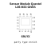

<!-- Generated item page. Full data lives in the source repository. -->
[Catalogue](../../../../../../README.md) / [Electronic](../../../../../README.md) / [Sensor](../../../../README.md) / [Gnss](../../../README.md) / [Module](../../README.md) / [Quectel](../README.md) / L86 M33

# ⚡ Sensor Module Quectel L86 M33 GNSS

> Sensor Module Quectel L86 M33 GNSS is an OOMP electronic sensor definition. It uses the gnss package or form factor. Its nominal drawing size is 18.4 × 18.4 mm. The definition includes 18 documented pins.

**[Full details →](https://github.com/oomlout/oomp_electronic_version_5/tree/main/parts/electronic_sensor_gnss_module_quectel_l86_m33)**

## At a glance

| Detail | Value |
| --- | --- |
| Type | Sensor |
| Package / style | gnss |
| Nominal size | 18.4 × 18.4 mm |
| Documented pins | 18 |
| OOMP ID | `electronic_sensor_gnss_module_quectel_l86_m33` |

## Catalogue location

`Electronic › Sensor › Gnss › Module › Quectel › L86 M33`

## About this page

This is the compact catalogue view. A detailed source README is available. Schematics, fabrication data, working metadata, alternate diagrams, availability data, and project analysis stay with the [full original record](https://github.com/oomlout/oomp_electronic_version_5/tree/main/parts/electronic_sensor_gnss_module_quectel_l86_m33).

---

[↑ Parent category](../README.md) · [Catalogue home](../../../../../../README.md)
