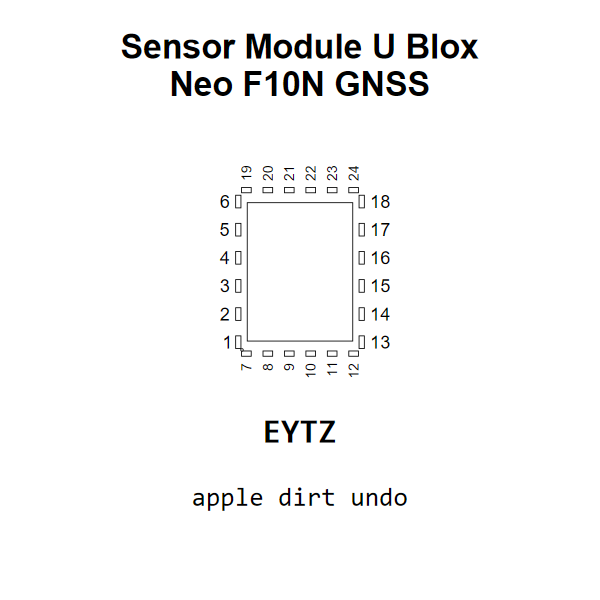

<!-- Generated item page. Full data lives in the source repository. -->
[Catalogue](../../../../../../README.md) / [Electronic](../../../../../README.md) / [Sensor](../../../../README.md) / [Gnss](../../../README.md) / [Module](../../README.md) / [U Blox](../README.md) / Neo F10n

# ⚡ Sensor Module U Blox Neo F10N GNSS

> Sensor Module U Blox Neo F10N GNSS is an OOMP electronic sensor definition. It uses the gnss package or form factor. Its nominal drawing size is 12.2 × 16.0 mm. The definition includes 24 documented pins.

[Full details →](https://github.com/oomlout/oomp_electronic_version_5/tree/main/parts/electronic_sensor_gnss_module_u_blox_neo_f10n)

## At a glance

| Detail | Value |
| --- | --- |
| Type | Sensor |
| Package / style | gnss |
| Nominal size | 12.2 × 16.0 mm |
| Documented pins | 24 |
| OOMP ID | `electronic_sensor_gnss_module_u_blox_neo_f10n` |

## Catalogue location

`Electronic › Sensor › Gnss › Module › U Blox › Neo F10n`

## About this page

This is the compact catalogue view. A detailed source README is available. Schematics, fabrication data, working metadata, alternate diagrams, availability data, and project analysis stay with the [full original record](https://github.com/oomlout/oomp_electronic_version_5/tree/main/parts/electronic_sensor_gnss_module_u_blox_neo_f10n).

---

[↑ Parent category](../README.md) · [Catalogue home](../../../../../../README.md)
