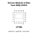

<!-- Generated item page. Full data lives in the source repository. -->
[Catalogue](../../../../../../README.md) / [Electronic](../../../../../README.md) / [Sensor](../../../../README.md) / [Gnss](../../../README.md) / [Module](../../README.md) / [U Blox](../README.md) / Sam M8q

# ⚡ Sensor Module U Blox Sam M8Q GNSS

> Sensor Module U Blox Sam M8Q GNSS is an OOMP electronic sensor definition. It uses the gnss package or form factor. Its nominal drawing size is 15.5 × 15.5 mm. The definition includes 20 documented pins.

**[Full details →](https://github.com/oomlout/oomp_electronic_version_5/tree/main/parts/electronic_sensor_gnss_module_u_blox_sam_m8q)**

## At a glance

| Detail | Value |
| --- | --- |
| Type | Sensor |
| Package / style | gnss |
| Nominal size | 15.5 × 15.5 mm |
| Documented pins | 20 |
| OOMP ID | `electronic_sensor_gnss_module_u_blox_sam_m8q` |

## Catalogue location

`Electronic › Sensor › Gnss › Module › U Blox › Sam M8q`

## About this page

This is the compact catalogue view. A detailed source README is available. Schematics, fabrication data, working metadata, alternate diagrams, availability data, and project analysis stay with the [full original record](https://github.com/oomlout/oomp_electronic_version_5/tree/main/parts/electronic_sensor_gnss_module_u_blox_sam_m8q).

---

[↑ Parent category](../README.md) · [Catalogue home](../../../../../../README.md)
