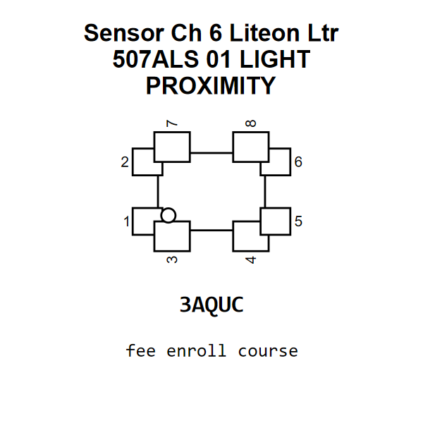

<!-- Generated item page. Full data lives in the source repository. -->
[Catalogue](../../../../../../README.md) / [Electronic](../../../../../README.md) / [Sensor](../../../../README.md) / [Light Proximity](../../../README.md) / [Ch 6](../../README.md) / [Liteon](../README.md) / Ltr 507als 01

# ⚡ Sensor Ch 6 Liteon Ltr 507ALS 01 LIGHT PROXIMITY

> Sensor Ch 6 Liteon Ltr 507ALS 01 LIGHT PROXIMITY is an OOMP electronic sensor definition. It uses the light proximity package or form factor. Its nominal drawing size is 2.65 × 2.0 mm. The definition includes 8 documented pins.

[Full details →](https://github.com/oomlout/oomp_electronic_version_5/tree/main/parts/electronic_sensor_light_proximity_ch_6_liteon_ltr_507als_01)

## At a glance

| Detail | Value |
| --- | --- |
| Type | Sensor |
| Package / style | light proximity |
| Nominal size | 2.65 × 2.0 mm |
| Documented pins | 8 |
| OOMP ID | `electronic_sensor_light_proximity_ch_6_liteon_ltr_507als_01` |

## Catalogue location

`Electronic › Sensor › Light Proximity › Ch 6 › Liteon › Ltr 507als 01`

## About this page

This is the compact catalogue view. A detailed source README is available. Schematics, fabrication data, working metadata, alternate diagrams, availability data, and project analysis stay with the [full original record](https://github.com/oomlout/oomp_electronic_version_5/tree/main/parts/electronic_sensor_light_proximity_ch_6_liteon_ltr_507als_01).

---

[↑ Parent category](../README.md) · [Catalogue home](../../../../../../README.md)
