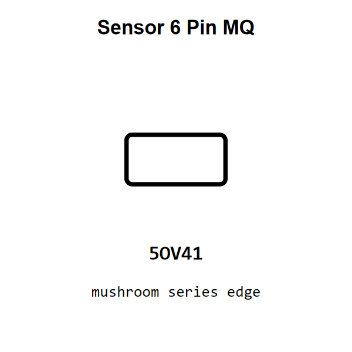

<!-- Generated item page. Full data lives in the source repository. -->
[Catalogue](../../../../README.md) / [Electronic](../../../README.md) / [Sensor](../../README.md) / [Mq](../README.md) / 6 Pin

# ⚡ Sensor 6 Pin MQ

> Sensor 6 Pin MQ is an OOMP electronic sensor definition. It uses the mq package or form factor. Its nominal drawing size is 10.0 × 5.0 mm.

[Full details →](https://github.com/oomlout/oomp_electronic_version_5/tree/main/parts/electronic_sensor_mq_6_pin)

## At a glance

| Detail | Value |
| --- | --- |
| Type | Sensor |
| Package / style | mq |
| Nominal size | 10.0 × 5.0 mm |
| OOMP ID | `electronic_sensor_mq_6_pin` |

## Catalogue location

`Electronic › Sensor › Mq › 6 Pin`

## About this page

This is the compact catalogue view. A detailed source README is available. Schematics, fabrication data, working metadata, alternate diagrams, availability data, and project analysis stay with the [full original record](https://github.com/oomlout/oomp_electronic_version_5/tree/main/parts/electronic_sensor_mq_6_pin).

---

[↑ Parent category](../README.md) · [Catalogue home](../../../../README.md)
