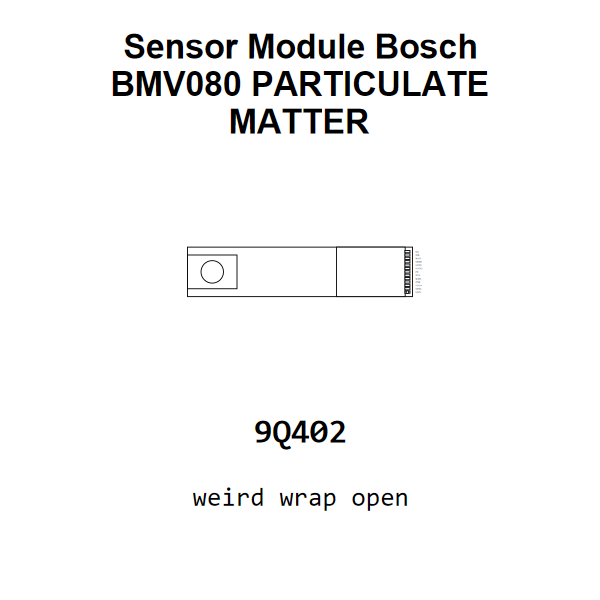

<!-- Generated item page. Full data lives in the source repository. -->
[Catalogue](../../../../../../README.md) / [Electronic](../../../../../README.md) / [Sensor](../../../../README.md) / [Particulate Matter](../../../README.md) / [Module](../../README.md) / [Bosch](../README.md) / Bmv080

# ⚡ Sensor Module Bosch BMV080 PARTICULATE MATTER

> Sensor Module Bosch BMV080 PARTICULATE MATTER is an OOMP electronic sensor definition. It uses the particulate matter package or form factor. Its nominal drawing size is 20.0 × 5.5 mm. The definition includes 13 documented pins.

[Full details →](https://github.com/oomlout/oomp_electronic_version_5/tree/main/parts/electronic_sensor_particulate_matter_module_bosch_bmv080)

## At a glance

| Detail | Value |
| --- | --- |
| Type | Sensor |
| Package / style | particulate matter |
| Nominal size | 20.0 × 5.5 mm |
| Documented pins | 13 |
| OOMP ID | `electronic_sensor_particulate_matter_module_bosch_bmv080` |

## Catalogue location

`Electronic › Sensor › Particulate Matter › Module › Bosch › Bmv080`

## About this page

This is the compact catalogue view. A detailed source README is available. Schematics, fabrication data, working metadata, alternate diagrams, availability data, and project analysis stay with the [full original record](https://github.com/oomlout/oomp_electronic_version_5/tree/main/parts/electronic_sensor_particulate_matter_module_bosch_bmv080).

---

[↑ Parent category](../README.md) · [Catalogue home](../../../../../../README.md)
