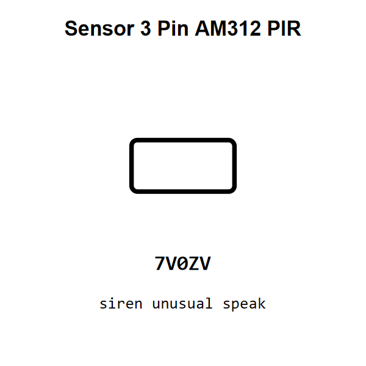

<!-- Generated item page. Full data lives in the source repository. -->
[Catalogue](../../../../../README.md) / [Electronic](../../../../README.md) / [Sensor](../../../README.md) / [Pir](../../README.md) / [3 Pin](../README.md) / Am312

# ⚡ Sensor 3 Pin AM312 PIR

> Sensor 3 Pin AM312 PIR is an OOMP electronic sensor definition. It uses the pir package or form factor. Its nominal drawing size is 10.0 × 5.0 mm.

[Full details →](https://github.com/oomlout/oomp_electronic_version_5/tree/main/parts/electronic_sensor_pir_3_pin_am312)

## At a glance

| Detail | Value |
| --- | --- |
| Type | Sensor |
| Package / style | pir |
| Nominal size | 10.0 × 5.0 mm |
| OOMP ID | `electronic_sensor_pir_3_pin_am312` |

## Catalogue location

`Electronic › Sensor › Pir › 3 Pin › Am312`

## About this page

This is the compact catalogue view. A detailed source README is available. Schematics, fabrication data, working metadata, alternate diagrams, availability data, and project analysis stay with the [full original record](https://github.com/oomlout/oomp_electronic_version_5/tree/main/parts/electronic_sensor_pir_3_pin_am312).

---

[↑ Parent category](../README.md) · [Catalogue home](../../../../../README.md)
