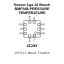

<!-- Generated item page. Full data lives in the source repository. -->
[Catalogue](../../../../../../README.md) / [Electronic](../../../../../README.md) / [Sensor](../../../../README.md) / [Pressure Temperature](../../../README.md) / [Lga 10](../../README.md) / [Bosch](../README.md) / Bmp388

# ⚡ Sensor Lga 10 Bosch BMP388 PRESSURE TEMPERATURE

> Sensor Lga 10 Bosch BMP388 PRESSURE TEMPERATURE is an OOMP electronic sensor definition. It uses the pressure temperature package or form factor. Its nominal drawing size is 2.0 × 2.0 mm. The definition includes 10 documented pins.

**[Full details →](https://github.com/oomlout/oomp_electronic_version_5/tree/main/parts/electronic_sensor_pressure_temperature_lga_10_bosch_bmp388)**

## At a glance

| Detail | Value |
| --- | --- |
| Type | Sensor |
| Package / style | pressure temperature |
| Nominal size | 2.0 × 2.0 mm |
| Documented pins | 10 |
| OOMP ID | `electronic_sensor_pressure_temperature_lga_10_bosch_bmp388` |

## Catalogue location

`Electronic › Sensor › Pressure Temperature › Lga 10 › Bosch › Bmp388`

## About this page

This is the compact catalogue view. A detailed source README is available. Schematics, fabrication data, working metadata, alternate diagrams, availability data, and project analysis stay with the [full original record](https://github.com/oomlout/oomp_electronic_version_5/tree/main/parts/electronic_sensor_pressure_temperature_lga_10_bosch_bmp388).

---

[↑ Parent category](../README.md) · [Catalogue home](../../../../../../README.md)
