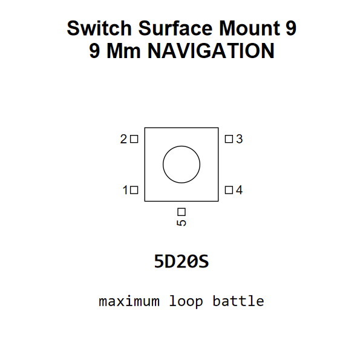

<!-- Generated item page. Full data lives in the source repository. -->
[Catalogue](../../../../../README.md) / [Electronic](../../../../README.md) / [Switch](../../../README.md) / [Navigation](../../README.md) / [Surface Mount](../README.md) / 9 9 Mm

# ⚡ Switch Surface Mount 9 9 Mm NAVIGATION

> Switch Surface Mount 9 9 Mm NAVIGATION is an OOMP electronic switch definition. It uses the navigation package or form factor. Its nominal drawing size is 9.9 × 9.9 mm. The definition includes 5 documented pins.

[Full details →](https://github.com/oomlout/oomp_electronic_version_5/tree/main/parts/electronic_switch_navigation_surface_mount_9_9_mm)

## At a glance

| Detail | Value |
| --- | --- |
| Type | Switch |
| Package / style | navigation |
| Nominal size | 9.9 × 9.9 mm |
| Documented pins | 5 |
| OOMP ID | `electronic_switch_navigation_surface_mount_9_9_mm` |

## Catalogue location

`Electronic › Switch › Navigation › Surface Mount › 9 9 Mm`

## About this page

This is the compact catalogue view. A detailed source README is available. Schematics, fabrication data, working metadata, alternate diagrams, availability data, and project analysis stay with the [full original record](https://github.com/oomlout/oomp_electronic_version_5/tree/main/parts/electronic_switch_navigation_surface_mount_9_9_mm).

---

[↑ Parent category](../README.md) · [Catalogue home](../../../../../README.md)
