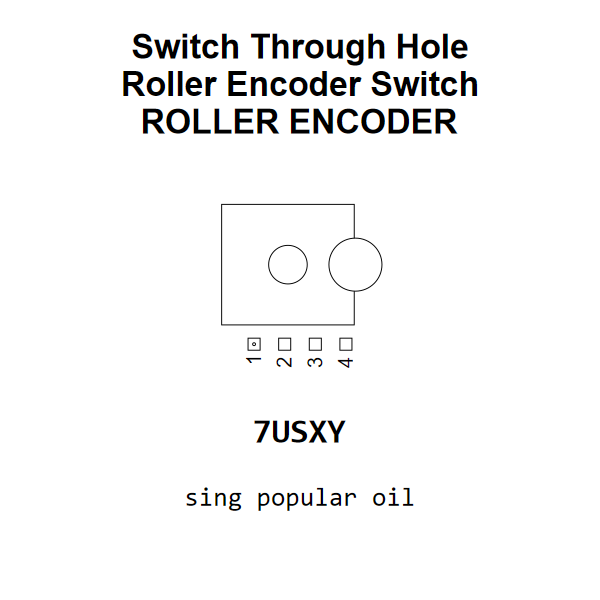

<!-- Generated item page. Full data lives in the source repository. -->
[Catalogue](../../../../../README.md) / [Electronic](../../../../README.md) / [Switch](../../../README.md) / [Roller Encoder](../../README.md) / [Through Hole](../README.md) / Roller Encoder Switch

# ⚡ Switch Through Hole Roller Encoder Switch ROLLER ENCODER

> Switch Through Hole Roller Encoder Switch ROLLER ENCODER is an OOMP electronic switch definition. It uses the roller encoder package or form factor. Its nominal drawing size is 16.8 × 14.0 mm. The definition includes 4 documented pins.

[Full details →](https://github.com/oomlout/oomp_electronic_version_5/tree/main/parts/electronic_switch_roller_encoder_through_hole_roller_encoder_switch)

## At a glance

| Detail | Value |
| --- | --- |
| Type | Switch |
| Package / style | roller encoder |
| Nominal size | 16.8 × 14.0 mm |
| Documented pins | 4 |
| OOMP ID | `electronic_switch_roller_encoder_through_hole_roller_encoder_switch` |

## Catalogue location

`Electronic › Switch › Roller Encoder › Through Hole › Roller Encoder Switch`

## About this page

This is the compact catalogue view. A detailed source README is available. Schematics, fabrication data, working metadata, alternate diagrams, availability data, and project analysis stay with the [full original record](https://github.com/oomlout/oomp_electronic_version_5/tree/main/parts/electronic_switch_roller_encoder_through_hole_roller_encoder_switch).

---

[↑ Parent category](../README.md) · [Catalogue home](../../../../../README.md)
