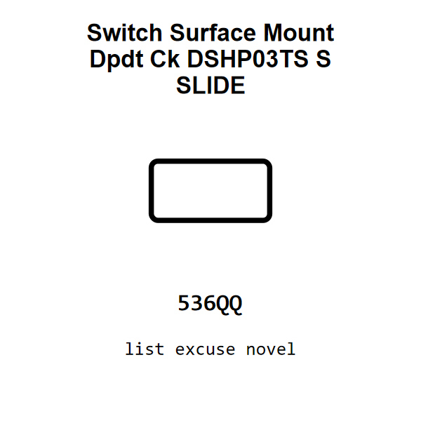

<!-- Generated item page. Full data lives in the source repository. -->
[Catalogue](../../../../../../../README.md) / [Electronic](../../../../../../README.md) / [Switch](../../../../../README.md) / [Slide](../../../../README.md) / [Surface Mount](../../../README.md) / [Dpdt](../../README.md) / [Ck](../README.md) / Dshp03ts S

# ⚡ Switch Surface Mount Dpdt Ck DSHP03TS S SLIDE

> Switch Surface Mount Dpdt Ck DSHP03TS S SLIDE is an OOMP electronic switch definition. It uses the slide package or form factor. Its nominal drawing size is 10.0 × 5.0 mm.

[Full details →](https://github.com/oomlout/oomp_electronic_version_5/tree/main/parts/electronic_switch_slide_surface_mount_dpdt_ck_dshp03ts_s)

## At a glance

| Detail | Value |
| --- | --- |
| Type | Switch |
| Package / style | slide |
| Nominal size | 10.0 × 5.0 mm |
| OOMP ID | `electronic_switch_slide_surface_mount_dpdt_ck_dshp03ts_s` |

## Catalogue location

`Electronic › Switch › Slide › Surface Mount › Dpdt › Ck › Dshp03ts S`

## About this page

This is the compact catalogue view. A detailed source README is available. Schematics, fabrication data, working metadata, alternate diagrams, availability data, and project analysis stay with the [full original record](https://github.com/oomlout/oomp_electronic_version_5/tree/main/parts/electronic_switch_slide_surface_mount_dpdt_ck_dshp03ts_s).

---

[↑ Parent category](../README.md) · [Catalogue home](../../../../../../../README.md)
