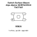

<!-- Generated item page. Full data lives in the source repository. -->
[Catalogue](../../../../../../README.md) / [Electronic](../../../../../README.md) / [Switch](../../../../README.md) / [Tactile](../../../README.md) / [Surface Mount](../../README.md) / [Alps Alpine](../README.md) / Skrpace010

# ⚡ Switch Surface Mount Alps Alpine SKRPACE010 TACTILE

> Switch Surface Mount Alps Alpine SKRPACE010 TACTILE is an OOMP electronic switch definition. It uses the tactile package or form factor. Its nominal drawing size is 4.2 × 3.2 mm. The definition includes 4 documented pins.

**[Full details →](https://github.com/oomlout/oomp_electronic_version_5/tree/main/parts/electronic_switch_tactile_surface_mount_alps_alpine_skrpace010)**

## At a glance

| Detail | Value |
| --- | --- |
| Type | Switch |
| Package / style | tactile |
| Nominal size | 4.2 × 3.2 mm |
| Documented pins | 4 |
| OOMP ID | `electronic_switch_tactile_surface_mount_alps_alpine_skrpace010` |

## Catalogue location

`Electronic › Switch › Tactile › Surface Mount › Alps Alpine › Skrpace010`

## About this page

This is the compact catalogue view. A detailed source README is available. Schematics, fabrication data, working metadata, alternate diagrams, availability data, and project analysis stay with the [full original record](https://github.com/oomlout/oomp_electronic_version_5/tree/main/parts/electronic_switch_tactile_surface_mount_alps_alpine_skrpace010).

---

[↑ Parent category](../README.md) · [Catalogue home](../../../../../../README.md)
