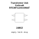

<!-- Generated item page. Full data lives in the source repository. -->
[Catalogue](../../../../../../README.md) / [Electronic](../../../../../README.md) / [Transformer](../../../../README.md) / [Surface Mount](../../../README.md) / [USB](../../README.md) / [Coilcraft](../README.md) / Rfcmf1220100m4t

# ⚡ Transformer Usb Coilcraft RFCMF1220100M4T SURFACE MOUNT

> Transformer Usb Coilcraft RFCMF1220100M4T SURFACE MOUNT is an OOMP electronic transformer definition. It uses the surface mount package or form factor. Its nominal drawing size is 12.0 × 10.0 mm. The definition includes 4 documented pins.

**[Full details →](https://github.com/oomlout/oomp_electronic_version_5/tree/main/parts/electronic_transformer_surface_mount_usb_coilcraft_rfcmf1220100m4t)**

## At a glance

| Detail | Value |
| --- | --- |
| Type | Transformer |
| Package / style | surface mount |
| Nominal size | 12.0 × 10.0 mm |
| Documented pins | 4 |
| OOMP ID | `electronic_transformer_surface_mount_usb_coilcraft_rfcmf1220100m4t` |

## Catalogue location

`Electronic › Transformer › Surface Mount › USB › Coilcraft › Rfcmf1220100m4t`

## About this page

This is the compact catalogue view. A detailed source README is available. Schematics, fabrication data, working metadata, alternate diagrams, availability data, and project analysis stay with the [full original record](https://github.com/oomlout/oomp_electronic_version_5/tree/main/parts/electronic_transformer_surface_mount_usb_coilcraft_rfcmf1220100m4t).

---

[↑ Parent category](../README.md) · [Catalogue home](../../../../../../README.md)
