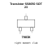

<!-- Generated item page. Full data lives in the source repository. -->
[Catalogue](../../../../../../../../../README.md) / [Electronic](../../../../../../../../README.md) / [Transistor](../../../../../../../README.md) / [Sot 23](../../../../../../README.md) / [Bipolar](../../../../../README.md) / [Npn](../../../../README.md) / [25 Volt](../../../README.md) / [1 5 Amp](../../README.md) / [Jsmsemi](../README.md) / Ss8050

# ⚡ Transistor SS8050 SOT 23

> Transistor SS8050 SOT 23 is an OOMP electronic transistor definition. It uses the sot 23 package or form factor. Its nominal drawing size is 2.9 × 2.4 mm. The definition includes 3 documented pins.

**[Full details →](https://github.com/oomlout/oomp_electronic_version_5/tree/main/parts/electronic_transistor_sot_23_bipolar_npn_25_volt_1_5_amp_jsmsemi_ss8050)**

## At a glance

| Detail | Value |
| --- | --- |
| Type | Transistor |
| Package / style | sot 23 |
| Nominal size | 2.9 × 2.4 mm |
| Documented pins | 3 |
| OOMP ID | `electronic_transistor_sot_23_bipolar_npn_25_volt_1_5_amp_jsmsemi_ss8050` |

## Catalogue location

`Electronic › Transistor › Sot 23 › Bipolar › Npn › 25 Volt › 1 5 Amp › Jsmsemi › Ss8050`

## About this page

This is the compact catalogue view. A detailed source README is available. Schematics, fabrication data, working metadata, alternate diagrams, availability data, and project analysis stay with the [full original record](https://github.com/oomlout/oomp_electronic_version_5/tree/main/parts/electronic_transistor_sot_23_bipolar_npn_25_volt_1_5_amp_jsmsemi_ss8050).

---

[↑ Parent category](../README.md) · [Catalogue home](../../../../../../../../../README.md)
