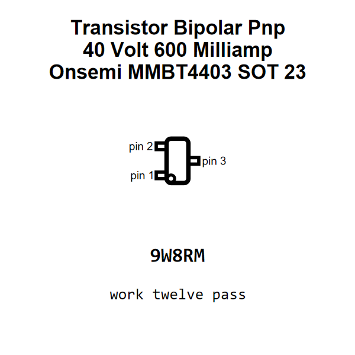

<!-- Generated item page. Full data lives in the source repository. -->
[Catalogue](../../../../../../../../../README.md) / [Electronic](../../../../../../../../README.md) / [Transistor](../../../../../../../README.md) / [Sot 23](../../../../../../README.md) / [Bipolar](../../../../../README.md) / [Pnp](../../../../README.md) / [40 Volt](../../../README.md) / [600 Milliamp](../../README.md) / [Onsemi](../README.md) / Mmbt4403

# ⚡ Transistor Bipolar Pnp 40 Volt 600 Milliamp Onsemi MMBT4403 SOT 23

> Transistor Bipolar Pnp 40 Volt 600 Milliamp Onsemi MMBT4403 SOT 23 is an OOMP electronic transistor definition. It uses the sot 23 package or form factor. Its nominal drawing size is 2.9 × 2.6 mm.

[Full details →](https://github.com/oomlout/oomp_electronic_version_5/tree/main/parts/electronic_transistor_sot_23_bipolar_pnp_40_volt_600_milliamp_onsemi_mmbt4403)

## At a glance

| Detail | Value |
| --- | --- |
| Type | Transistor |
| Package / style | sot 23 |
| Nominal size | 2.9 × 2.6 mm |
| OOMP ID | `electronic_transistor_sot_23_bipolar_pnp_40_volt_600_milliamp_onsemi_mmbt4403` |

## Catalogue location

`Electronic › Transistor › Sot 23 › Bipolar › Pnp › 40 Volt › 600 Milliamp › Onsemi › Mmbt4403`

## About this page

This is the compact catalogue view. A detailed source README is available. Schematics, fabrication data, working metadata, alternate diagrams, availability data, and project analysis stay with the [full original record](https://github.com/oomlout/oomp_electronic_version_5/tree/main/parts/electronic_transistor_sot_23_bipolar_pnp_40_volt_600_milliamp_onsemi_mmbt4403).

---

[↑ Parent category](../README.md) · [Catalogue home](../../../../../../../../../README.md)
