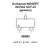

<!-- Generated item page. Full data lives in the source repository. -->
[Catalogue](../../../../../../../../README.md) / [Electronic](../../../../../../../README.md) / [Transistor](../../../../../../README.md) / [Sot 23](../../../../../README.md) / [Mosfet](../../../../README.md) / [N Channel](../../../README.md) / [Enhancement Mode](../../README.md) / [60 Volt](../README.md) / 2n7002

# ⚡ N-channel MOSFET 2N7002 SOT-23 (generic)

> N-channel MOSFET 2N7002 SOT-23 (generic) is an OOMP electronic transistor definition. It uses the sot 23 package or form factor. Its nominal drawing size is 2.9 × 2.3 mm. The definition includes 3 documented pins.

**[Full details →](https://github.com/oomlout/oomp_electronic_version_5/tree/main/parts/electronic_transistor_sot_23_mosfet_n_channel_enhancement_mode_60_volt_2n7002)**

## At a glance

| Detail | Value |
| --- | --- |
| Type | Transistor |
| Package / style | sot 23 |
| Nominal size | 2.9 × 2.3 mm |
| Documented pins | 3 |
| OOMP ID | `electronic_transistor_sot_23_mosfet_n_channel_enhancement_mode_60_volt_2n7002` |

## Catalogue location

`Electronic › Transistor › Sot 23 › Mosfet › N Channel › Enhancement Mode › 60 Volt › 2n7002`

## About this page

This is the compact catalogue view. A detailed source README is available. Schematics, fabrication data, working metadata, alternate diagrams, availability data, and project analysis stay with the [full original record](https://github.com/oomlout/oomp_electronic_version_5/tree/main/parts/electronic_transistor_sot_23_mosfet_n_channel_enhancement_mode_60_volt_2n7002).

---

[↑ Parent category](../README.md) · [Catalogue home](../../../../../../../../README.md)
