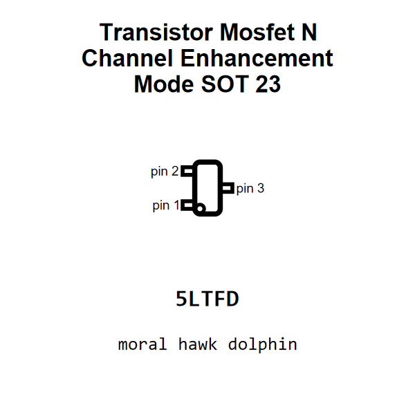

<!-- Generated item page. Full data lives in the source repository. -->
[Catalogue](../../../../../../README.md) / [Electronic](../../../../../README.md) / [Transistor](../../../../README.md) / [Sot 23](../../../README.md) / [Mosfet](../../README.md) / [N Channel](../README.md) / Enhancement Mode

# ⚡ Transistor Mosfet N Channel Enhancement Mode SOT 23

> Transistor Mosfet N Channel Enhancement Mode SOT 23 is an OOMP electronic transistor definition. It uses the sot 23 package or form factor. Its nominal drawing size is 2.9 × 2.6 mm.

[Full details →](https://github.com/oomlout/oomp_electronic_version_5/tree/main/parts/electronic_transistor_sot_23_mosfet_n_channel_enhancement_mode)

## At a glance

| Detail | Value |
| --- | --- |
| Type | Transistor |
| Package / style | sot 23 |
| Nominal size | 2.9 × 2.6 mm |
| OOMP ID | `electronic_transistor_sot_23_mosfet_n_channel_enhancement_mode` |

## Catalogue location

`Electronic › Transistor › Sot 23 › Mosfet › N Channel › Enhancement Mode`

## Explore

- **[50 Volt](50_volt/README.md)**   2 components
- **[60 Volt](60_volt/README.md)**   3 components

## About this page

This is the compact catalogue view. A detailed source README is available. Schematics, fabrication data, working metadata, alternate diagrams, availability data, and project analysis stay with the [full original record](https://github.com/oomlout/oomp_electronic_version_5/tree/main/parts/electronic_transistor_sot_23_mosfet_n_channel_enhancement_mode).

---

[↑ Parent category](../README.md) · [Catalogue home](../../../../../../README.md)
