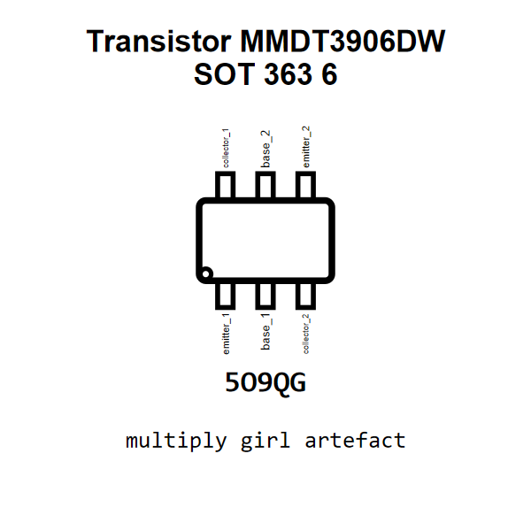

<!-- Generated item page. Full data lives in the source repository. -->
[Catalogue](../../../../../../../../../../README.md) / [Electronic](../../../../../../../../../README.md) / [Transistor](../../../../../../../../README.md) / [Sot 363 6](../../../../../../../README.md) / [Bipolar](../../../../../../README.md) / [Pnp](../../../../../README.md) / [Dual General Purpose](../../../../README.md) / [40 Volt](../../../README.md) / [200 Milliamp](../../README.md) / [Cbi](../README.md) / Mmdt3906dw

# ⚡ Transistor MMDT3906DW SOT 363 6

> Transistor MMDT3906DW SOT 363 6 is an OOMP electronic transistor definition. It uses the sot 363 6 package or form factor. Its nominal drawing size is 2.1 × 2.3 mm. The definition includes 6 documented pins.

[Full details →](https://github.com/oomlout/oomp_electronic_version_5/tree/main/parts/electronic_transistor_sot_363_6_bipolar_pnp_dual_general_purpose_40_volt_200_milliamp_cbi_mmdt3906dw)

## At a glance

| Detail | Value |
| --- | --- |
| Type | Transistor |
| Package / style | sot 363 6 |
| Nominal size | 2.1 × 2.3 mm |
| Documented pins | 6 |
| OOMP ID | `electronic_transistor_sot_363_6_bipolar_pnp_dual_general_purpose_40_volt_200_milliamp_cbi_mmdt3906dw` |

## Catalogue location

`Electronic › Transistor › Sot 363 6 › Bipolar › Pnp › Dual General Purpose › 40 Volt › 200 Milliamp › Cbi › Mmdt3906dw`

## About this page

This is the compact catalogue view. A detailed source README is available. Schematics, fabrication data, working metadata, alternate diagrams, availability data, and project analysis stay with the [full original record](https://github.com/oomlout/oomp_electronic_version_5/tree/main/parts/electronic_transistor_sot_363_6_bipolar_pnp_dual_general_purpose_40_volt_200_milliamp_cbi_mmdt3906dw).

---

[↑ Parent category](../README.md) · [Catalogue home](../../../../../../../../../../README.md)
