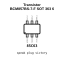

<!-- Generated item page. Full data lives in the source repository. -->
[Catalogue](../../../../../../../../../../README.md) / [Electronic](../../../../../../../../../README.md) / [Transistor](../../../../../../../../README.md) / [Sot 363 6](../../../../../../../README.md) / [Bipolar](../../../../../../README.md) / [Pnp](../../../../../README.md) / [Dual Matched Pair](../../../../README.md) / [45 Volt](../../../README.md) / [100 Milliamp](../../README.md) / [Diodes Incorporated](../README.md) / Bcm857bs 7 F

# ⚡ Transistor BCM857BS-7-F SOT 363 6

> Transistor BCM857BS-7-F SOT 363 6 is an OOMP electronic transistor definition. It uses the sot 363 6 package or form factor. Its nominal drawing size is 2.15 × 2.1 mm. The definition includes 6 documented pins.

**[Full details →](https://github.com/oomlout/oomp_electronic_version_5/tree/main/parts/electronic_transistor_sot_363_6_bipolar_pnp_dual_matched_pair_45_volt_100_milliamp_diodes_incorporated_bcm857bs_7_f)**

## At a glance

| Detail | Value |
| --- | --- |
| Type | Transistor |
| Package / style | sot 363 6 |
| Nominal size | 2.15 × 2.1 mm |
| Documented pins | 6 |
| OOMP ID | `electronic_transistor_sot_363_6_bipolar_pnp_dual_matched_pair_45_volt_100_milliamp_diodes_incorporated_bcm857bs_7_f` |

## Catalogue location

`Electronic › Transistor › Sot 363 6 › Bipolar › Pnp › Dual Matched Pair › 45 Volt › 100 Milliamp › Diodes Incorporated › Bcm857bs 7 F`

## About this page

This is the compact catalogue view. A detailed source README is available. Schematics, fabrication data, working metadata, alternate diagrams, availability data, and project analysis stay with the [full original record](https://github.com/oomlout/oomp_electronic_version_5/tree/main/parts/electronic_transistor_sot_363_6_bipolar_pnp_dual_matched_pair_45_volt_100_milliamp_diodes_incorporated_bcm857bs_7_f).

---

[↑ Parent category](../README.md) · [Catalogue home](../../../../../../../../../../README.md)
