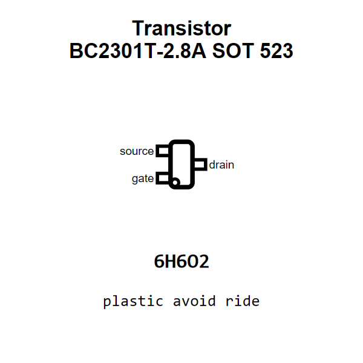

<!-- Generated item page. Full data lives in the source repository. -->
[Catalogue](../../../../../../../../../../README.md) / [Electronic](../../../../../../../../../README.md) / [Transistor](../../../../../../../../README.md) / [Sot 523](../../../../../../../README.md) / [Mosfet](../../../../../../README.md) / [P Channel](../../../../../README.md) / [Enhancement Mode](../../../../README.md) / [20 Volt](../../../README.md) / [2 8 Amp](../../README.md) / [Cbi](../README.md) / Bc2301t 2 8a

# ⚡ Transistor BC2301T-2.8A SOT 523

> Transistor BC2301T-2.8A SOT 523 is an OOMP electronic transistor definition. It uses the sot 523 package or form factor. Its nominal drawing size is 1.6 × 1.6 mm. The definition includes 3 documented pins.

[Full details →](https://github.com/oomlout/oomp_electronic_version_5/tree/main/parts/electronic_transistor_sot_523_mosfet_p_channel_enhancement_mode_20_volt_2_8_amp_cbi_bc2301t_2_8a)

## At a glance

| Detail | Value |
| --- | --- |
| Type | Transistor |
| Package / style | sot 523 |
| Nominal size | 1.6 × 1.6 mm |
| Documented pins | 3 |
| OOMP ID | `electronic_transistor_sot_523_mosfet_p_channel_enhancement_mode_20_volt_2_8_amp_cbi_bc2301t_2_8a` |

## Catalogue location

`Electronic › Transistor › Sot 523 › Mosfet › P Channel › Enhancement Mode › 20 Volt › 2 8 Amp › Cbi › Bc2301t 2 8a`

## About this page

This is the compact catalogue view. A detailed source README is available. Schematics, fabrication data, working metadata, alternate diagrams, availability data, and project analysis stay with the [full original record](https://github.com/oomlout/oomp_electronic_version_5/tree/main/parts/electronic_transistor_sot_523_mosfet_p_channel_enhancement_mode_20_volt_2_8_amp_cbi_bc2301t_2_8a).

---

[↑ Parent category](../README.md) · [Catalogue home](../../../../../../../../../../README.md)
