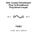

<!-- Generated item page. Full data lives in the source repository. -->
[Catalogue](../../../../../../../../README.md) / [Electronic](../../../../../../../README.md) / [Wire](../../../../../../README.md) / [Prototyping](../../../../../README.md) / [Jumper](../../../../README.md) / [Breadboard Plug](../../../README.md) / [To Breadboard Plug](../../README.md) / [Mixed Length](../README.md) / Bundle Rainbow 75 Pieces

# ⚡ Wire Jumper Breadboard Plug To Breadboard Plug Mixed Length Bundle Rainbow

> Wire Jumper Breadboard Plug To Breadboard Plug Mixed Length Bundle Rainbow 75 Pieces PROTOTYPING is an OOMP electronic wire definition. It uses the prototyping package or form factor. Its nominal drawing size is 150 × 2.0 mm.

**[Full details →](https://github.com/oomlout/oomp_electronic_version_5/tree/main/parts/electronic_wire_prototyping_jumper_breadboard_plug_to_breadboard_plug_mixed_length_bundle_rainbow_75_pieces)**

## At a glance

| Detail | Value |
| --- | --- |
| Type | Wire |
| Package / style | prototyping |
| Nominal size | 150 × 2.0 mm |
| OOMP ID | `electronic_wire_prototyping_jumper_breadboard_plug_to_breadboard_plug_mixed_length_bundle_rainbow_75_pieces` |

## Catalogue location

`Electronic › Wire › Prototyping › Jumper › Breadboard Plug › To Breadboard Plug › Mixed Length › Bundle Rainbow 75 Pieces`

## About this page

This is the compact catalogue view. A detailed source README is available. Schematics, fabrication data, working metadata, alternate diagrams, availability data, and project analysis stay with the [full original record](https://github.com/oomlout/oomp_electronic_version_5/tree/main/parts/electronic_wire_prototyping_jumper_breadboard_plug_to_breadboard_plug_mixed_length_bundle_rainbow_75_pieces).

---

[↑ Parent category](../README.md) · [Catalogue home](../../../../../../../../README.md)
