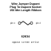

<!-- Generated item page. Full data lives in the source repository. -->
[Catalogue](../../../../../../../../README.md) / [Electronic](../../../../../../../README.md) / [Wire](../../../../../../README.md) / [Prototyping](../../../../../README.md) / [Jumper](../../../../README.md) / [Dupont Plug](../../../README.md) / [To Dupont Socket](../../README.md) / [150 Mm Length](../README.md) / Ribbon Cable Rainbow 40

# ⚡ Wire Jumper Dupont Plug To Dupont Socket 150 Mm Length Ribbon Cable Rainbow

> Wire Jumper Dupont Plug To Dupont Socket 150 Mm Length Ribbon Cable Rainbow 40 PROTOTYPING is an OOMP electronic wire definition. It uses the prototyping package or form factor. Its nominal drawing size is 150 × 2.0 mm.

**[Full details →](https://github.com/oomlout/oomp_electronic_version_5/tree/main/parts/electronic_wire_prototyping_jumper_dupont_plug_to_dupont_socket_150_mm_length_ribbon_cable_rainbow_40)**

## At a glance

| Detail | Value |
| --- | --- |
| Type | Wire |
| Package / style | prototyping |
| Nominal size | 150 × 2.0 mm |
| OOMP ID | `electronic_wire_prototyping_jumper_dupont_plug_to_dupont_socket_150_mm_length_ribbon_cable_rainbow_40` |

## Catalogue location

`Electronic › Wire › Prototyping › Jumper › Dupont Plug › To Dupont Socket › 150 Mm Length › Ribbon Cable Rainbow 40`

## About this page

This is the compact catalogue view. A detailed source README is available. Schematics, fabrication data, working metadata, alternate diagrams, availability data, and project analysis stay with the [full original record](https://github.com/oomlout/oomp_electronic_version_5/tree/main/parts/electronic_wire_prototyping_jumper_dupont_plug_to_dupont_socket_150_mm_length_ribbon_cable_rainbow_40).

---

[↑ Parent category](../README.md) · [Catalogue home](../../../../../../../../README.md)
