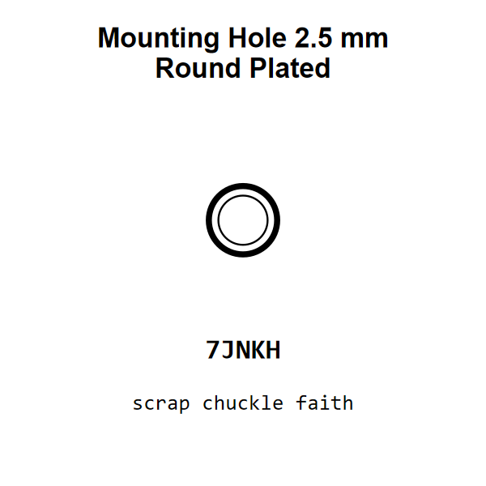

<!-- Generated item page. Full data lives in the source repository. -->
[Catalogue](../../../../../README.md) / [Mechanical](../../../../README.md) / [Mounting Hole](../../../README.md) / [2 5 Mm](../../README.md) / [Round](../README.md) / Plated

# ⚙️ Mounting Hole 2.5 mm Round Plated

> Mounting Hole 2.5 mm Round Plated is an OOMP mechanical mounting hole definition. It uses the 2 5 mm package or form factor. Its nominal drawing size is 2.5 × 2.5 mm.

[Full details →](https://github.com/oomlout/oomp_electronic_version_5/tree/main/parts/mechanical_mounting_hole_2_5_mm_round_plated)

## At a glance

| Detail | Value |
| --- | --- |
| Type | Mounting Hole |
| Package / style | 2 5 mm |
| Nominal size | 2.5 × 2.5 mm |
| OOMP ID | `mechanical_mounting_hole_2_5_mm_round_plated` |

## Catalogue location

`Mechanical › Mounting Hole › 2 5 Mm › Round › Plated`

## About this page

This is the compact catalogue view. A detailed source README is available. Schematics, fabrication data, working metadata, alternate diagrams, availability data, and project analysis stay with the [full original record](https://github.com/oomlout/oomp_electronic_version_5/tree/main/parts/mechanical_mounting_hole_2_5_mm_round_plated).

---

[↑ Parent category](../README.md) · [Catalogue home](../../../../../README.md)
