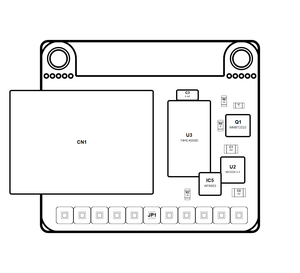

<!-- Generated item page. Full data lives in the source repository. -->
[Catalogue](../../../../../../../README.md) / [OOMP](../../../../../../README.md) / [Project](../../../../../README.md) / [GitHub](../../../../README.md) / [Adafruit](../../../README.md) / [Adafruit 0 96 160x80 Tft Display Breakout PCB](../../README.md) / [Adafruit 0 96in 160x80 Tft Display](../README.md) / Current

# 🧭 Project adafruit/Adafruit-0.96-160x80-TFT-Display-Breakout-PCB Adafruit

> Project adafruit/Adafruit-0.96-160x80-TFT-Display-Breakout-PCB Adafruit 0.96in 160x80 TFT Display current is a KiCad project containing 47 extracted component records. The catalogue matcher linked 9 physical placements to OOMP parts.

**[Open board explorer ↗](https://html-preview.github.io/?url=https://github.com/oomlout/oomp_electronic_verison_5_pretty/blob/main/catalogue/oomp/project/github/adafruit/adafruit_0_96_160x80_tft_display_breakout_pcb/adafruit_0_96in_160x80_tft_display/current/board_explorer.html)** · [HTML file](board_explorer.html) · [Full details →](https://github.com/oomlout/oomp_electronic_version_5/tree/main/parts/oomp_project_github_adafruit_adafruit_0_96_160x80_tft_display_breakout_pcb_adafruit_0_96in_160x80_tft_display_current) · [Original project files](https://github.com/adafruit/Adafruit-0.96-160x80-TFT-Display-Breakout-PCB/blob/master/Adafruit%200.96in%20160x80%20TFT%20Display.brd)

## At a glance

| Detail | Value |
| --- | --- |
| Components | 47 |
| PCB footprints | 30 |
| Mounting and locating holes | 12 |
| Matched OOMP mounting-hole items | 2 |
| Schematic symbols | 35 |
| Matched OOMP components | 9 |
| Unmatched physical components | 16 |
| Front-side placements | 13 |
| Back-side placements | 0 |
| Project version | current |
| Git ref | master |
| OOMP ID | `oomp_project_github_adafruit_adafruit_0_96_160x80_tft_display_breakout_pcb_adafruit_0_96in_160x80_tft_display_current` |

## Catalogue location

`OOMP › Project › GitHub › Adafruit › Adafruit 0 96 160x80 Tft Display Breakout PCB › Adafruit 0 96in 160x80 Tft Display › Current`

## About this page

This is the compact catalogue view. A detailed source README is available. The [interactive board explorer](https://html-preview.github.io/?url=https://github.com/oomlout/oomp_electronic_verison_5_pretty/blob/main/catalogue/oomp/project/github/adafruit/adafruit_0_96_160x80_tft_display_breakout_pcb/adafruit_0_96in_160x80_tft_display/current/board_explorer.html) is included as a self-contained HTML page. Schematics, fabrication data, working metadata, alternate diagrams, availability data, and project analysis stay with the [full original record](https://github.com/oomlout/oomp_electronic_version_5/tree/main/parts/oomp_project_github_adafruit_adafruit_0_96_160x80_tft_display_breakout_pcb_adafruit_0_96in_160x80_tft_display_current).

---

[↑ Parent category](../README.md) · [Catalogue home](../../../../../../../README.md)
