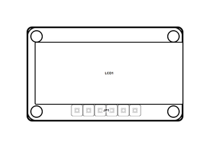

<!-- Generated item page. Full data lives in the source repository. -->
[Catalogue](../../../../../../../README.md) / [OOMP](../../../../../../README.md) / [Project](../../../../../README.md) / [GitHub](../../../../README.md) / [Adafruit](../../../README.md) / [Adafruit 128x32 I2 C Oled Breakout PCB](../../README.md) / [Adafruit Oled 128x32 Mono I2 C](../README.md) / Current

# 🧭 Project adafruit/Adafruit-128x32-I2C-OLED-Breakout-PCB Adafruit OLED

> Project adafruit/Adafruit-128x32-I2C-OLED-Breakout-PCB Adafruit OLED 128x32 Mono I2 C current is a KiCad project containing 39 extracted component records. The catalogue matcher linked 17 physical placements to OOMP parts.

**[Open board explorer ↗](https://html-preview.github.io/?url=https://github.com/oomlout/oomp_electronic_verison_5_pretty/blob/main/catalogue/oomp/project/github/adafruit/adafruit_128x32_i2_c_oled_breakout_pcb/adafruit_oled_128x32_mono_i2_c/current/board_explorer.html)** · [HTML file](board_explorer.html) · [Full details →](https://github.com/oomlout/oomp_electronic_version_5/tree/main/parts/oomp_project_github_adafruit_adafruit_128x32_i2_c_oled_breakout_pcb_adafruit_oled_128x32_mono_i2_c_current) · [Original project files](https://github.com/adafruit/Adafruit-128x32-I2C-OLED-Breakout-PCB/blob/master/Adafruit%20OLED%20128x32%20Mono%20I2C.brd)

## At a glance

| Detail | Value |
| --- | --- |
| Components | 39 |
| PCB footprints | 26 |
| Mounting and locating holes | 4 |
| Matched OOMP mounting-hole items | 4 |
| Schematic symbols | 34 |
| Matched OOMP components | 17 |
| Unmatched physical components | 6 |
| Front-side placements | 2 |
| Back-side placements | 17 |
| Project version | current |
| Git ref | master |
| OOMP ID | `oomp_project_github_adafruit_adafruit_128x32_i2_c_oled_breakout_pcb_adafruit_oled_128x32_mono_i2_c_current` |

## Catalogue location

`OOMP › Project › GitHub › Adafruit › Adafruit 128x32 I2 C Oled Breakout PCB › Adafruit Oled 128x32 Mono I2 C › Current`

## About this page

This is the compact catalogue view. A detailed source README is available. The [interactive board explorer](https://html-preview.github.io/?url=https://github.com/oomlout/oomp_electronic_verison_5_pretty/blob/main/catalogue/oomp/project/github/adafruit/adafruit_128x32_i2_c_oled_breakout_pcb/adafruit_oled_128x32_mono_i2_c/current/board_explorer.html) is included as a self-contained HTML page. Schematics, fabrication data, working metadata, alternate diagrams, availability data, and project analysis stay with the [full original record](https://github.com/oomlout/oomp_electronic_version_5/tree/main/parts/oomp_project_github_adafruit_adafruit_128x32_i2_c_oled_breakout_pcb_adafruit_oled_128x32_mono_i2_c_current).

---

[↑ Parent category](../README.md) · [Catalogue home](../../../../../../../README.md)
