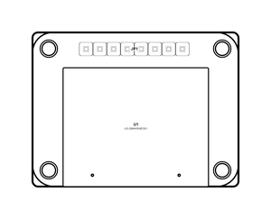

<!-- Generated item page. Full data lives in the source repository. -->
[Catalogue](../../../../../../../README.md) / [OOMP](../../../../../../README.md) / [Project](../../../../../README.md) / [GitHub](../../../../README.md) / [Adafruit](../../../README.md) / [Adafruit 128x64 Monochrome Oled PCB](../../README.md) / [128x64 Mono Oled V2](../README.md) / Current

# 🧭 Project adafruit/Adafruit-128x64-Monochrome-OLED-PCB 128x64 Mono OLED

> Project adafruit/Adafruit-128x64-Monochrome-OLED-PCB 128x64 Mono OLED PCB v2 current is a KiCad project containing 56 extracted component records. The catalogue matcher linked 22 physical placements to OOMP parts.

**[Open board explorer ↗](https://html-preview.github.io/?url=https://github.com/oomlout/oomp_electronic_verison_5_pretty/blob/main/catalogue/oomp/project/github/adafruit/adafruit_128x64_monochrome_oled_pcb/128x64_mono_oled_v2/current/board_explorer.html)** · [HTML file](board_explorer.html) · [Full details →](https://github.com/oomlout/oomp_electronic_version_5/tree/main/parts/oomp_project_github_adafruit_adafruit_128x64_monochrome_oled_pcb_128x64_mono_oled_v2_current) · [Original project files](https://github.com/adafruit/Adafruit-128x64-Monochrome-OLED-PCB/blob/master/Adafruit%20128x64%20Mono%20OLED%20PCB%20v2.brd)

## At a glance

| Detail | Value |
| --- | --- |
| Components | 56 |
| PCB footprints | 36 |
| Mounting and locating holes | 6 |
| Matched OOMP mounting-hole items | 4 |
| Schematic symbols | 53 |
| Matched OOMP components | 22 |
| Unmatched physical components | 7 |
| Front-side placements | 2 |
| Back-side placements | 23 |
| Project version | current |
| Git ref | master |
| OOMP ID | `oomp_project_github_adafruit_adafruit_128x64_monochrome_oled_pcb_128x64_mono_oled_v2_current` |

## Catalogue location

`OOMP › Project › GitHub › Adafruit › Adafruit 128x64 Monochrome Oled PCB › 128x64 Mono Oled V2 › Current`

## About this page

This is the compact catalogue view. A detailed source README is available. The [interactive board explorer](https://html-preview.github.io/?url=https://github.com/oomlout/oomp_electronic_verison_5_pretty/blob/main/catalogue/oomp/project/github/adafruit/adafruit_128x64_monochrome_oled_pcb/128x64_mono_oled_v2/current/board_explorer.html) is included as a self-contained HTML page. Schematics, fabrication data, working metadata, alternate diagrams, availability data, and project analysis stay with the [full original record](https://github.com/oomlout/oomp_electronic_version_5/tree/main/parts/oomp_project_github_adafruit_adafruit_128x64_monochrome_oled_pcb_128x64_mono_oled_v2_current).

---

[↑ Parent category](../README.md) · [Catalogue home](../../../../../../../README.md)
