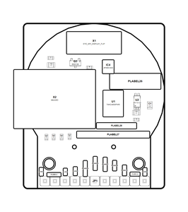

<!-- Generated item page. Full data lives in the source repository. -->
[Catalogue](../../../../../../../README.md) / [OOMP](../../../../../../README.md) / [Project](../../../../../README.md) / [GitHub](../../../../README.md) / [Adafruit](../../../README.md) / [Adafruit 1 28 240x240 Round Display PCB](../../README.md) / [Adafruit 1 28 240x240 Round Display](../README.md) / Current

# 🧭 Project adafruit/Adafruit-1.28-240x240-Round-Display-PCB Adafruit 1.28

> Project adafruit/Adafruit-1.28-240x240-Round-Display-PCB Adafruit 1.28 240x240 Round Display current is a KiCad project containing 75 extracted component records. The catalogue matcher linked 15 physical placements to OOMP parts.

**[Open board explorer ↗](https://html-preview.github.io/?url=https://github.com/oomlout/oomp_electronic_verison_5_pretty/blob/main/catalogue/oomp/project/github/adafruit/adafruit_1_28_240x240_round_display_pcb/adafruit_1_28_240x240_round_display/current/board_explorer.html)** · [HTML file](board_explorer.html) · [Full details →](https://github.com/oomlout/oomp_electronic_version_5/tree/main/parts/oomp_project_github_adafruit_adafruit_1_28_240x240_round_display_pcb_adafruit_1_28_240x240_round_display_current) · [Original project files](https://github.com/adafruit/Adafruit-1.28-240x240-Round-Display-PCB/blob/main/Adafruit%201.28%20240x240%20Round%20Display.brd)

## At a glance

| Detail | Value |
| --- | --- |
| Components | 75 |
| PCB footprints | 45 |
| Mounting and locating holes | 4 |
| Matched OOMP mounting-hole items | 4 |
| Schematic symbols | 52 |
| Matched OOMP components | 15 |
| Unmatched physical components | 25 |
| Front-side placements | 31 |
| Back-side placements | 7 |
| Project version | current |
| Git ref | main |
| OOMP ID | `oomp_project_github_adafruit_adafruit_1_28_240x240_round_display_pcb_adafruit_1_28_240x240_round_display_current` |

## Catalogue location

`OOMP › Project › GitHub › Adafruit › Adafruit 1 28 240x240 Round Display PCB › Adafruit 1 28 240x240 Round Display › Current`

## About this page

This is the compact catalogue view. A detailed source README is available. The [interactive board explorer](https://html-preview.github.io/?url=https://github.com/oomlout/oomp_electronic_verison_5_pretty/blob/main/catalogue/oomp/project/github/adafruit/adafruit_1_28_240x240_round_display_pcb/adafruit_1_28_240x240_round_display/current/board_explorer.html) is included as a self-contained HTML page. Schematics, fabrication data, working metadata, alternate diagrams, availability data, and project analysis stay with the [full original record](https://github.com/oomlout/oomp_electronic_version_5/tree/main/parts/oomp_project_github_adafruit_adafruit_1_28_240x240_round_display_pcb_adafruit_1_28_240x240_round_display_current).

---

[↑ Parent category](../README.md) · [Catalogue home](../../../../../../../README.md)
