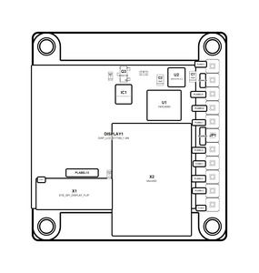

<!-- Generated item page. Full data lives in the source repository. -->
[Catalogue](../../../../../../../README.md) / [OOMP](../../../../../../README.md) / [Project](../../../../../README.md) / [GitHub](../../../../README.md) / [Adafruit](../../../README.md) / [Adafruit 1 3 Inch 240x240 Tft PCB](../../README.md) / [Adafruit 1 3in 240x240 Ips Tft Eyespi](../README.md) / Current

# 🧭 Project adafruit/Adafruit-1.3-inch-240x240-TFT-PCB Adafruit 1.3in 240x240

> Project adafruit/Adafruit-1.3-inch-240x240-TFT-PCB Adafruit 1.3in 240x240 IPS TFT EYESPI current is a KiCad project containing 72 extracted component records. The catalogue matcher linked 11 physical placements to OOMP parts.

**[Open board explorer ↗](https://html-preview.github.io/?url=https://github.com/oomlout/oomp_electronic_verison_5_pretty/blob/main/catalogue/oomp/project/github/adafruit/adafruit_1_3_inch_240x240_tft_pcb/adafruit_1_3in_240x240_ips_tft_eyespi/current/board_explorer.html)** · [HTML file](board_explorer.html) · [Full details →](https://github.com/oomlout/oomp_electronic_version_5/tree/main/parts/oomp_project_github_adafruit_adafruit_1_3_inch_240x240_tft_pcb_adafruit_1_3in_240x240_ips_tft_eyespi_current) · [Original project files](https://github.com/adafruit/Adafruit-1.3-inch-240x240-TFT-PCB/blob/master/Adafruit%201.3in%20240x240%20IPS%20TFT%20EYESPI.brd)

## At a glance

| Detail | Value |
| --- | --- |
| Components | 72 |
| PCB footprints | 45 |
| Mounting and locating holes | 4 |
| Matched OOMP mounting-hole items | 4 |
| Schematic symbols | 50 |
| Matched OOMP components | 11 |
| Unmatched physical components | 30 |
| Front-side placements | 26 |
| Back-side placements | 11 |
| Project version | current |
| Git ref | master |
| OOMP ID | `oomp_project_github_adafruit_adafruit_1_3_inch_240x240_tft_pcb_adafruit_1_3in_240x240_ips_tft_eyespi_current` |

## Catalogue location

`OOMP › Project › GitHub › Adafruit › Adafruit 1 3 Inch 240x240 Tft PCB › Adafruit 1 3in 240x240 Ips Tft Eyespi › Current`

## About this page

This is the compact catalogue view. A detailed source README is available. The [interactive board explorer](https://html-preview.github.io/?url=https://github.com/oomlout/oomp_electronic_verison_5_pretty/blob/main/catalogue/oomp/project/github/adafruit/adafruit_1_3_inch_240x240_tft_pcb/adafruit_1_3in_240x240_ips_tft_eyespi/current/board_explorer.html) is included as a self-contained HTML page. Schematics, fabrication data, working metadata, alternate diagrams, availability data, and project analysis stay with the [full original record](https://github.com/oomlout/oomp_electronic_version_5/tree/main/parts/oomp_project_github_adafruit_adafruit_1_3_inch_240x240_tft_pcb_adafruit_1_3in_240x240_ips_tft_eyespi_current).

---

[↑ Parent category](../README.md) · [Catalogue home](../../../../../../../README.md)
