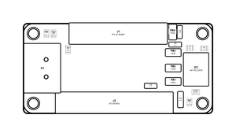

<!-- Generated item page. Full data lives in the source repository. -->
[Catalogue](../../../../../../../README.md) / [OOMP](../../../../../../README.md) / [Project](../../../../../README.md) / [GitHub](../../../../README.md) / [Adafruit](../../../README.md) / [Adafruit 50pin To 40pin Tft With Ar1100 Adapter PCB](../../README.md) / [Adafruit 50pin To 40pin Tft With Ar1100 Adapter](../README.md) / Current

# 🧭 Project adafruit/Adafruit-50pin-to-40pin-TFT-with-AR1100-Adapter-PCB

> Project adafruit/Adafruit-50pin-to-40pin-TFT-with-AR1100-Adapter-PCB Adafruit 50pin to 40pin TFT with AR1100 Adapter current is a KiCad project containing 47 extracted component records. The catalogue matcher linked 11 physical placements to OOMP parts.

**[Open board explorer ↗](https://html-preview.github.io/?url=https://github.com/oomlout/oomp_electronic_verison_5_pretty/blob/main/catalogue/oomp/project/github/adafruit/adafruit_50pin_to_40pin_tft_with_ar1100_adapter_pcb/adafruit_50pin_to_40pin_tft_with_ar1100_adapter/current/board_explorer.html)** · [HTML file](board_explorer.html) · [Full details →](https://github.com/oomlout/oomp_electronic_version_5/tree/main/parts/oomp_project_github_adafruit_adafruit_50pin_to_40pin_tft_with_ar1100_adapter_pcb_adafruit_50pin_to_40pin_tft_with_ar1100_adapter_current) · [Original project files](https://github.com/adafruit/Adafruit-50pin-to-40pin-TFT-with-AR1100-Adapter-PCB/blob/master/Adafruit%2050pin%20to%2040pin%20TFT%20with%20AR1100%20Adapter.brd)

## At a glance

| Detail | Value |
| --- | --- |
| Components | 47 |
| PCB footprints | 30 |
| Mounting and locating holes | 6 |
| Matched OOMP mounting-hole items | 6 |
| Schematic symbols | 133 |
| Matched OOMP components | 11 |
| Unmatched physical components | 12 |
| Front-side placements | 19 |
| Back-side placements | 0 |
| Project version | current |
| Git ref | master |
| OOMP ID | `oomp_project_github_adafruit_adafruit_50pin_to_40pin_tft_with_ar1100_adapter_pcb_adafruit_50pin_to_40pin_tft_with_ar1100_adapter_current` |

## Catalogue location

`OOMP › Project › GitHub › Adafruit › Adafruit 50pin To 40pin Tft With Ar1100 Adapter PCB › Adafruit 50pin To 40pin Tft With Ar1100 Adapter › Current`

## About this page

This is the compact catalogue view. A detailed source README is available. The [interactive board explorer](https://html-preview.github.io/?url=https://github.com/oomlout/oomp_electronic_verison_5_pretty/blob/main/catalogue/oomp/project/github/adafruit/adafruit_50pin_to_40pin_tft_with_ar1100_adapter_pcb/adafruit_50pin_to_40pin_tft_with_ar1100_adapter/current/board_explorer.html) is included as a self-contained HTML page. Schematics, fabrication data, working metadata, alternate diagrams, availability data, and project analysis stay with the [full original record](https://github.com/oomlout/oomp_electronic_version_5/tree/main/parts/oomp_project_github_adafruit_adafruit_50pin_to_40pin_tft_with_ar1100_adapter_pcb_adafruit_50pin_to_40pin_tft_with_ar1100_adapter_current).

---

[↑ Parent category](../README.md) · [Catalogue home](../../../../../../../README.md)
