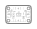

<!-- Generated item page. Full data lives in the source repository. -->
[Catalogue](../../../../../../../README.md) / [OOMP](../../../../../../README.md) / [Project](../../../../../README.md) / [GitHub](../../../../README.md) / [Adafruit](../../../README.md) / [Adafruit Adxl345 PCB](../../README.md) / [Adxl345 Stemma Qt](../README.md) / Current

# 🧭 Project adafruit/Adafruit_ADXL345_PCB ADXL345 STEMMA QT current

> Project adafruit/Adafruit_ADXL345_PCB ADXL345 STEMMA QT current is a KiCad project containing 48 extracted component records. The catalogue matcher linked 18 physical placements to OOMP parts.

**[Full details →](https://github.com/oomlout/oomp_electronic_version_5/tree/main/parts/oomp_project_github_adafruit_adafruit_adxl345_pcb_adxl345_stemma_qt_current)** · [Original project files](https://github.com/adafruit/Adafruit_ADXL345_PCB/blob/master/ADXL345%20STEMMA%20QT.brd)

## At a glance

| Detail | Value |
| --- | --- |
| Components | 48 |
| PCB footprints | 26 |
| Mounting and locating holes | 4 |
| Matched OOMP mounting-hole items | 4 |
| Schematic symbols | 54 |
| Matched OOMP components | 18 |
| Unmatched physical components | 0 |
| Front-side placements | 14 |
| Back-side placements | 0 |
| Project version | current |
| Git ref | master |
| OOMP ID | `oomp_project_github_adafruit_adafruit_adxl345_pcb_adxl345_stemma_qt_current` |

## Catalogue location

`OOMP › Project › GitHub › Adafruit › Adafruit Adxl345 PCB › Adxl345 Stemma Qt › Current`

## About this page

This is the compact catalogue view. A detailed source README is available. Schematics, fabrication data, working metadata, alternate diagrams, availability data, and project analysis stay with the [full original record](https://github.com/oomlout/oomp_electronic_version_5/tree/main/parts/oomp_project_github_adafruit_adafruit_adxl345_pcb_adxl345_stemma_qt_current).

---

[↑ Parent category](../README.md) · [Catalogue home](../../../../../../../README.md)
