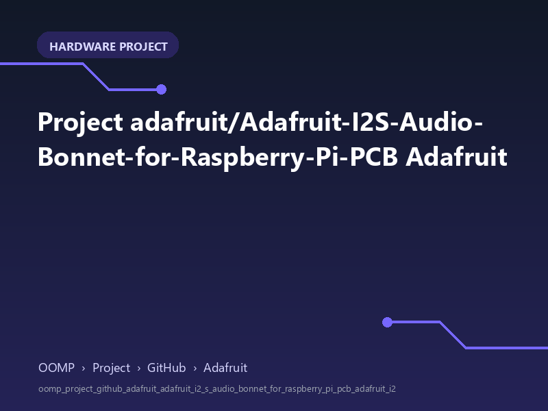

<!-- Generated item page. Full data lives in the source repository. -->
[Catalogue](../../../../../../../README.md) / [OOMP](../../../../../../README.md) / [Project](../../../../../README.md) / [GitHub](../../../../README.md) / [Adafruit](../../../README.md) / [Adafruit I2 S Audio Bonnet For Raspberry Pi PCB](../../README.md) / [Adafruit I2 S Audio Uda1334 Bonnet](../README.md) / Current

# 🧭 Project adafruit/Adafruit-I2S-Audio-Bonnet-for-Raspberry-Pi-PCB Adafruit

> A concise OOMP hardware project organised under OOMP › Project › GitHub › Adafruit.

**[Open board explorer ↗](https://oomlout.github.io/oomp_electronic_verison_5_pretty/catalogue/oomp/project/github/adafruit/adafruit_i2_s_audio_bonnet_for_raspberry_pi_pcb/adafruit_i2_s_audio_uda1334_bonnet/current/board_explorer.html)** · [Full details →](https://github.com/oomlout/oomp_electronic_version_5/tree/main/parts/oomp_project_github_adafruit_adafruit_i2_s_audio_bonnet_for_raspberry_pi_pcb_adafruit_i2_s_audio_uda1334_bonnet_current) · [Original project files](https://github.com/adafruit/Adafruit-I2S-Audio-Bonnet-for-Raspberry-Pi-PCB/blob/master/Adafruit%20I2S%20Audio%20UDA1334%20Bonnet.brd)

## At a glance

| Detail | Value |
| --- | --- |
| Owner | adafruit |
| Repository | Adafruit-I2S-Audio-Bonnet-for-Raspberry-Pi-PCB |
| Board | Adafruit I2 S Audio UDA1334 Bonnet |
| Source format | eagle |
| Version | current |
| Git ref | master |
| OOMP ID | `oomp_project_github_adafruit_adafruit_i2_s_audio_bonnet_for_raspberry_pi_pcb_adafruit_i2_s_audio_uda1334_bonnet_current` |

## Catalogue location

`OOMP › Project › GitHub › Adafruit › Adafruit I2 S Audio Bonnet For Raspberry Pi PCB › Adafruit I2 S Audio Uda1334 Bonnet › Current`

## About this page

This is the compact catalogue view. This index entry was built directly from its working metadata. The [board explorer page](https://oomlout.github.io/oomp_electronic_verison_5_pretty/catalogue/oomp/project/github/adafruit/adafruit_i2_s_audio_bonnet_for_raspberry_pi_pcb/adafruit_i2_s_audio_uda1334_bonnet/current/board_explorer.html) currently shows the project preview and source links; interactive board geometry will appear after the source project has been processed. Schematics, fabrication data, working metadata, alternate diagrams, availability data, and project analysis stay with the [full original record](https://github.com/oomlout/oomp_electronic_version_5/tree/main/parts/oomp_project_github_adafruit_adafruit_i2_s_audio_bonnet_for_raspberry_pi_pcb_adafruit_i2_s_audio_uda1334_bonnet_current).

---

[↑ Parent category](../README.md) · [Catalogue home](../../../../../../../README.md)
