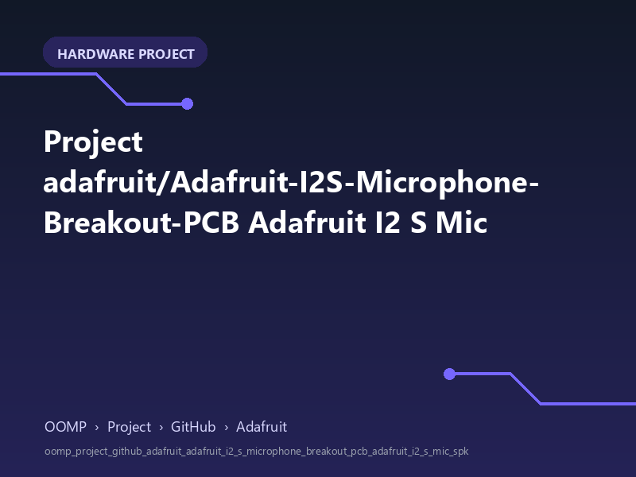

<!-- Generated item page. Full data lives in the source repository. -->
[Catalogue](../../../../../../../README.md) / [OOMP](../../../../../../README.md) / [Project](../../../../../README.md) / [GitHub](../../../../README.md) / [Adafruit](../../../README.md) / [Adafruit I2 S Microphone Breakout PCB](../../README.md) / [Adafruit I2 S Mic Spk0415 Hm4 H](../README.md) / Current

# 🧭 Project adafruit/Adafruit-I2S-Microphone-Breakout-PCB Adafruit I2 S Mic

> A concise OOMP hardware project organised under OOMP › Project › GitHub › Adafruit.

**[Open board explorer ↗](https://html-preview.github.io/?url=https://github.com/oomlout/oomp_electronic_verison_5_pretty/blob/main/catalogue/oomp/project/github/adafruit/adafruit_i2_s_microphone_breakout_pcb/adafruit_i2_s_mic_spk0415_hm4_h/current/board_explorer.html)** · [HTML file](board_explorer.html) · [Full details →](https://github.com/oomlout/oomp_electronic_version_5/tree/main/parts/oomp_project_github_adafruit_adafruit_i2_s_microphone_breakout_pcb_adafruit_i2_s_mic_spk0415_hm4_h_current) · [Original project files](https://github.com/adafruit/Adafruit-I2S-Microphone-Breakout-PCB/blob/master/Adafruit%20I2S%20Mic%20SPK0415HM4H.brd)

## At a glance

| Detail | Value |
| --- | --- |
| Owner | adafruit |
| Repository | Adafruit-I2S-Microphone-Breakout-PCB |
| Board | Adafruit I2 S Mic SPK0415 HM4 H |
| Source format | eagle |
| Version | current |
| Git ref | master |
| OOMP ID | `oomp_project_github_adafruit_adafruit_i2_s_microphone_breakout_pcb_adafruit_i2_s_mic_spk0415_hm4_h_current` |

## Catalogue location

`OOMP › Project › GitHub › Adafruit › Adafruit I2 S Microphone Breakout PCB › Adafruit I2 S Mic Spk0415 Hm4 H › Current`

## About this page

This is the compact catalogue view. This index entry was built directly from its working metadata. The [board explorer page](https://html-preview.github.io/?url=https://github.com/oomlout/oomp_electronic_verison_5_pretty/blob/main/catalogue/oomp/project/github/adafruit/adafruit_i2_s_microphone_breakout_pcb/adafruit_i2_s_mic_spk0415_hm4_h/current/board_explorer.html) currently shows the project preview and source links; interactive board geometry will appear after the source project has been processed. Schematics, fabrication data, working metadata, alternate diagrams, availability data, and project analysis stay with the [full original record](https://github.com/oomlout/oomp_electronic_version_5/tree/main/parts/oomp_project_github_adafruit_adafruit_i2_s_microphone_breakout_pcb_adafruit_i2_s_mic_spk0415_hm4_h_current).

---

[↑ Parent category](../README.md) · [Catalogue home](../../../../../../../README.md)
