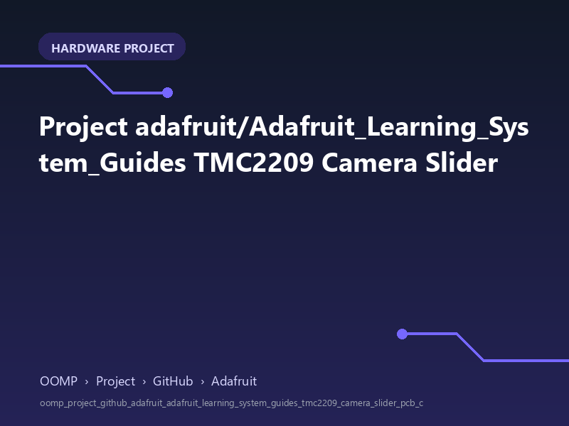

<!-- Generated item page. Full data lives in the source repository. -->
[Catalogue](../../../../../../../README.md) / [OOMP](../../../../../../README.md) / [Project](../../../../../README.md) / [GitHub](../../../../README.md) / [Adafruit](../../../README.md) / [Adafruit Learning System Guides](../../README.md) / [Tmc2209 Camera Slider PCB](../README.md) / Current

# 🧭 Project adafruit/Adafruit_Learning_System_Guides TMC2209 Camera Slider

> A concise OOMP hardware project organised under OOMP › Project › GitHub › Adafruit.

**[Open board explorer ↗](https://oomlout.github.io/oomp_electronic_verison_5_pretty/catalogue/oomp/project/github/adafruit/adafruit_learning_system_guides/tmc2209_camera_slider_pcb/current/board_explorer.html)** · [Full details →](https://github.com/oomlout/oomp_electronic_version_5/tree/main/parts/oomp_project_github_adafruit_adafruit_learning_system_guides_tmc2209_camera_slider_pcb_current) · [Original project files](https://github.com/adafruit/Adafruit_Learning_System_Guides/blob/main/TMC2209_Camera_Slider/PCB_Files/TMC2209_Camera_Slider_PCB_revB.brd)

## At a glance

| Detail | Value |
| --- | --- |
| Owner | adafruit |
| Repository | Adafruit_Learning_System_Guides |
| Board | TMC2209 Camera Slider PCB |
| Source format | eagle |
| Version | current |
| Git ref | main |
| OOMP ID | `oomp_project_github_adafruit_adafruit_learning_system_guides_tmc2209_camera_slider_pcb_current` |

## Catalogue location

`OOMP › Project › GitHub › Adafruit › Adafruit Learning System Guides › Tmc2209 Camera Slider PCB › Current`

## About this page

This is the compact catalogue view. This index entry was built directly from its working metadata. The [board explorer page](https://oomlout.github.io/oomp_electronic_verison_5_pretty/catalogue/oomp/project/github/adafruit/adafruit_learning_system_guides/tmc2209_camera_slider_pcb/current/board_explorer.html) currently shows the project preview and source links; interactive board geometry will appear after the source project has been processed. Schematics, fabrication data, working metadata, alternate diagrams, availability data, and project analysis stay with the [full original record](https://github.com/oomlout/oomp_electronic_version_5/tree/main/parts/oomp_project_github_adafruit_adafruit_learning_system_guides_tmc2209_camera_slider_pcb_current).

---

[↑ Parent category](../README.md) · [Catalogue home](../../../../../../../README.md)
