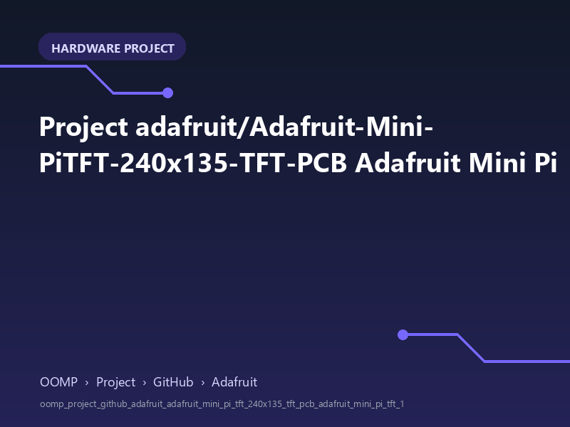

<!-- Generated item page. Full data lives in the source repository. -->
[Catalogue](../../../../../../../README.md) / [OOMP](../../../../../../README.md) / [Project](../../../../../README.md) / [GitHub](../../../../README.md) / [Adafruit](../../../README.md) / [Adafruit Mini Pi Tft 240x135 Tft PCB](../../README.md) / [Adafruit Mini Pi Tft 135x240 Color Tft](../README.md) / Current

# 🧭 Project adafruit/Adafruit-Mini-PiTFT-240x135-TFT-PCB Adafruit Mini Pi

> A concise OOMP hardware project organised under OOMP › Project › GitHub › Adafruit.

**[Open board explorer ↗](https://oomlout.github.io/oomp_electronic_verison_5_pretty/catalogue/oomp/project/github/adafruit/adafruit_mini_pi_tft_240x135_tft_pcb/adafruit_mini_pi_tft_135x240_color_tft/current/board_explorer.html)** · [Full details →](https://github.com/oomlout/oomp_electronic_version_5/tree/main/parts/oomp_project_github_adafruit_adafruit_mini_pi_tft_240x135_tft_pcb_adafruit_mini_pi_tft_135x240_color_tft_current) · [Original project files](https://github.com/adafruit/Adafruit-Mini-PiTFT-240x135-TFT-PCB/blob/master/Adafruit%20Mini%20PiTFT%20-%20135x240%20Color%20TFT.brd)

## At a glance

| Detail | Value |
| --- | --- |
| Owner | adafruit |
| Repository | Adafruit-Mini-PiTFT-240x135-TFT-PCB |
| Board | Adafruit Mini Pi TFT 135x240 Color TFT |
| Source format | eagle |
| Version | current |
| Git ref | master |
| OOMP ID | `oomp_project_github_adafruit_adafruit_mini_pi_tft_240x135_tft_pcb_adafruit_mini_pi_tft_135x240_color_tft_current` |

## Catalogue location

`OOMP › Project › GitHub › Adafruit › Adafruit Mini Pi Tft 240x135 Tft PCB › Adafruit Mini Pi Tft 135x240 Color Tft › Current`

## About this page

This is the compact catalogue view. This index entry was built directly from its working metadata. The [board explorer page](https://oomlout.github.io/oomp_electronic_verison_5_pretty/catalogue/oomp/project/github/adafruit/adafruit_mini_pi_tft_240x135_tft_pcb/adafruit_mini_pi_tft_135x240_color_tft/current/board_explorer.html) currently shows the project preview and source links; interactive board geometry will appear after the source project has been processed. Schematics, fabrication data, working metadata, alternate diagrams, availability data, and project analysis stay with the [full original record](https://github.com/oomlout/oomp_electronic_version_5/tree/main/parts/oomp_project_github_adafruit_adafruit_mini_pi_tft_240x135_tft_pcb_adafruit_mini_pi_tft_135x240_color_tft_current).

---

[↑ Parent category](../README.md) · [Catalogue home](../../../../../../../README.md)
