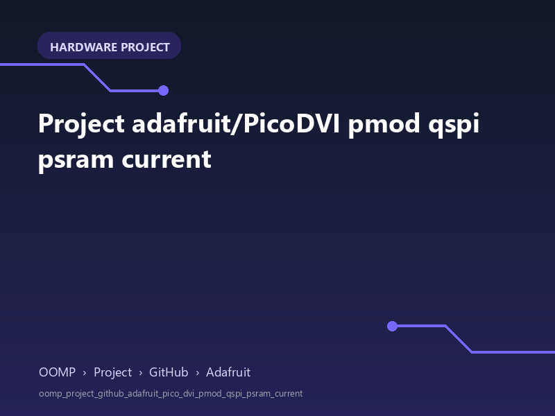

<!-- Generated item page. Full data lives in the source repository. -->
[Catalogue](../../../../../../../README.md) / [OOMP](../../../../../../README.md) / [Project](../../../../../README.md) / [GitHub](../../../../README.md) / [Adafruit](../../../README.md) / [Pico Dvi](../../README.md) / [Pmod Qspi Psram](../README.md) / Current

# 🧭 Project adafruit/PicoDVI pmod qspi psram current

> A concise OOMP hardware project organised under OOMP › Project › GitHub › Adafruit.

**[Open board explorer ↗](https://html-preview.github.io/?url=https://github.com/oomlout/oomp_electronic_verison_5_pretty/blob/main/catalogue/oomp/project/github/adafruit/pico_dvi/pmod_qspi_psram/current/board_explorer.html)** · [HTML file](board_explorer.html) · [Full details →](https://github.com/oomlout/oomp_electronic_version_5/tree/main/parts/oomp_project_github_adafruit_pico_dvi_pmod_qspi_psram_current) · [Original project files](https://github.com/adafruit/PicoDVI/blob/master/hardware/pmod_qspi_psram/pmod_qspi_psram.kicad_pcb)

## At a glance

| Detail | Value |
| --- | --- |
| Owner | adafruit |
| Repository | PicoDVI |
| Board | pmod qspi psram |
| Version | current |
| Git ref | master |
| OOMP ID | `oomp_project_github_adafruit_pico_dvi_pmod_qspi_psram_current` |

## Catalogue location

`OOMP › Project › GitHub › Adafruit › Pico Dvi › Pmod Qspi Psram › Current`

## About this page

This is the compact catalogue view. This index entry was built directly from its working metadata. The [board explorer page](https://html-preview.github.io/?url=https://github.com/oomlout/oomp_electronic_verison_5_pretty/blob/main/catalogue/oomp/project/github/adafruit/pico_dvi/pmod_qspi_psram/current/board_explorer.html) currently shows the project preview and source links; interactive board geometry will appear after the source project has been processed. Schematics, fabrication data, working metadata, alternate diagrams, availability data, and project analysis stay with the [full original record](https://github.com/oomlout/oomp_electronic_version_5/tree/main/parts/oomp_project_github_adafruit_pico_dvi_pmod_qspi_psram_current).

---

[↑ Parent category](../README.md) · [Catalogue home](../../../../../../../README.md)
