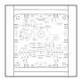

<!-- Generated item page. Full data lives in the source repository. -->
[Catalogue](../../../../../../README.md) / [OOMP](../../../../../README.md) / [Project](../../../../README.md) / [GitHub](../../../README.md) / [Dangerousprototypes](../../README.md) / [Buspirate5 Hardware](../README.md) / Current

# 🧭 Project dangerousprototypes/buspirate5_hardware current

> Project dangerousprototypes/buspirate5_hardware current is a KiCad project containing 440 extracted component records. The catalogue matcher linked 212 physical placements to OOMP parts.

**[Full details →](https://github.com/oomlout/oomp_electronic_version_5/tree/main/parts/oomp_project_github_dangerousprototypes_buspirate5_hardware_current)** · [Original project files](https://github.com/DangerousPrototypes/BusPirate5-hardware)

## At a glance

| Detail | Value |
| --- | --- |
| Components | 440 |
| PCB footprints | 220 |
| Mounting and locating holes | 6 |
| Matched OOMP mounting-hole items | 6 |
| Schematic symbols | 504 |
| Matched OOMP components | 212 |
| Unmatched physical components | 0 |
| Front-side placements | 205 |
| Back-side placements | 3 |
| Project version | current |
| Git ref | main |
| OOMP ID | `oomp_project_github_dangerousprototypes_buspirate5_hardware_current` |

## Catalogue location

`OOMP › Project › GitHub › Dangerousprototypes › Buspirate5 Hardware › Current`

## About this page

This is the compact catalogue view. A detailed source README is available. Schematics, fabrication data, working metadata, alternate diagrams, availability data, and project analysis stay with the [full original record](https://github.com/oomlout/oomp_electronic_version_5/tree/main/parts/oomp_project_github_dangerousprototypes_buspirate5_hardware_current).

---

[↑ Parent category](../README.md) · [Catalogue home](../../../../../../README.md)
