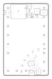

<!-- Generated item page. Full data lives in the source repository. -->
[Catalogue](../../../../../../../README.md) / [OOMP](../../../../../../README.md) / [Project](../../../../../README.md) / [GitHub](../../../../README.md) / [Electrolama](../../../README.md) / [Oshcamp23 Badge](../../README.md) / [Oshcamp23 Badge](../README.md) / Current

# 🧭 Project electrolama/oshcamp23-badge OSHCamp 2023 Badge current

> Project electrolama/oshcamp23-badge OSHCamp 2023 Badge current is a KiCad project containing 154 extracted component records. The catalogue matcher linked 73 physical placements to OOMP parts.

**[Full details →](https://github.com/oomlout/oomp_electronic_version_5/tree/main/parts/oomp_project_github_electrolama_oshcamp23_badge_oshcamp23_badge_current)** · [Original project files](https://github.com/electrolama/oshcamp23-badge/tree/main/oomp/version_current/working)

## At a glance

| Detail | Value |
| --- | --- |
| Components | 154 |
| PCB footprints | 76 |
| Mounting and locating holes | 20 |
| Matched OOMP mounting-hole items | 2 |
| Schematic symbols | 111 |
| Matched OOMP components | 73 |
| Unmatched physical components | 24 |
| Front-side placements | 54 |
| Back-side placements | 0 |
| Project version | current |
| Git ref | main |
| OOMP ID | `oomp_project_github_electrolama_oshcamp23_badge_oshcamp23_badge_current` |

## Catalogue location

`OOMP › Project › GitHub › Electrolama › Oshcamp23 Badge › Oshcamp23 Badge › Current`

## About this page

This is the compact catalogue view. A detailed source README is available. Schematics, fabrication data, working metadata, alternate diagrams, availability data, and project analysis stay with the [full original record](https://github.com/oomlout/oomp_electronic_version_5/tree/main/parts/oomp_project_github_electrolama_oshcamp23_badge_oshcamp23_badge_current).

---

[↑ Parent category](../README.md) · [Catalogue home](../../../../../../../README.md)
