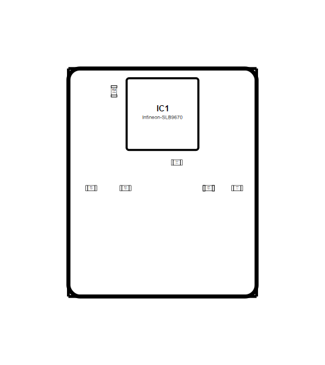

<!-- Generated item page. Full data lives in the source repository. -->
[Catalogue](../../../../../../../README.md) / [OOMP](../../../../../../README.md) / [Project](../../../../../README.md) / [GitHub](../../../../README.md) / [Electrolama](../../../README.md) / [Tpm Modules](../../README.md) / [Tpm Module 12pin Spi](../README.md) / Current

# 🧭 Project electrolama/tpm-modules TPM Module 12 Pin SPI current

> Project electrolama/tpm-modules TPM Module 12 Pin SPI current is a KiCad project containing 18 extracted component records. The catalogue matcher linked 8 physical placements to OOMP parts.

**[Open board explorer ↗](https://oomlout.github.io/oomp_electronic_verison_5_pretty/catalogue/oomp/project/github/electrolama/tpm_modules/tpm_module_12pin_spi/current/board_explorer.html)** · [Full details →](https://github.com/oomlout/oomp_electronic_version_5/tree/main/parts/oomp_project_github_electrolama_tpm_modules_tpm_module_12pin_spi_current) · [Original project files](https://github.com/electrolama/tpm-modules/tree/main/tpm-module-12pin-spi/Revision%20A1)

## At a glance

| Detail | Value |
| --- | --- |
| Components | 18 |
| PCB footprints | 8 |
| Mounting and locating holes | 0 |
| Matched OOMP mounting-hole items | 0 |
| Schematic symbols | 18 |
| Matched OOMP components | 8 |
| Unmatched physical components | 0 |
| Front-side placements | 7 |
| Back-side placements | 1 |
| Project version | current |
| Git ref | main |
| OOMP ID | `oomp_project_github_electrolama_tpm_modules_tpm_module_12pin_spi_current` |

## Catalogue location

`OOMP › Project › GitHub › Electrolama › Tpm Modules › Tpm Module 12pin Spi › Current`

## About this page

This is the compact catalogue view. A detailed source README is available. The [interactive board explorer](https://oomlout.github.io/oomp_electronic_verison_5_pretty/catalogue/oomp/project/github/electrolama/tpm_modules/tpm_module_12pin_spi/current/board_explorer.html) is included as a self-contained HTML page. Schematics, fabrication data, working metadata, alternate diagrams, availability data, and project analysis stay with the [full original record](https://github.com/oomlout/oomp_electronic_version_5/tree/main/parts/oomp_project_github_electrolama_tpm_modules_tpm_module_12pin_spi_current).

---

[↑ Parent category](../README.md) · [Catalogue home](../../../../../../../README.md)
